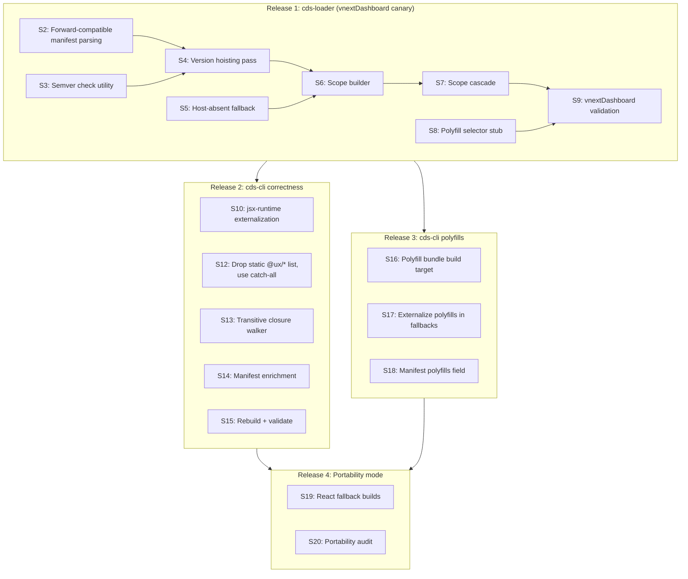

# CDS-Loader Release Stories: vnextDashboard First

## Release Strategy

vnextDashboard runs **mixed loader modes** (cds/wmfe/esm) and is on **React 18 with React 19 on the horizon**. This means:

- ESM loader improvements only benefit components already using `loaderMode='esm'`
- All changes must be backward-compatible with cds/wmfe components on the same page
- React 18->19 migration pressure makes the jsx-runtime fix and scope isolation the highest-value work
- vnextDashboard is the **canary** -- soak there before advertising the new loader to other hosts

The plan's Wave structure maps to **three npm releases** (loader, builder-correctness, builder-polyfills), with stories inside each. vnextDashboard gates the first release; subsequent releases are component-side and transparent to hosts.



---

## Activation Model: Manifest-Driven, Not Flag-Driven

The new version isolation behavior (hoisting, scoping, cascade) is **gated by the manifest data itself**, not by a host-side config flag or localStorage toggle. The rule is simple:

> If no ESM component in the registry carries the enriched manifest fields (`reactVersion`, `built`), the loader runs the **existing first-come-wins code path unchanged**. The new hoisting/scoping logic only activates when at least one component provides the metadata it needs to make decisions.

This means:

1. **Release 1** (loader) ships with both code paths side by side
2. **With today's manifests**: old path runs. Zero behavioral change. The new code is dead code until enriched manifests arrive.
3. **When Release 2 components rebuild** with the new cds-cli: they carry `reactVersion`/`built` in their registry entries. The loader detects this and switches to the new path for those components.
4. **Rollback** is rebuilding the component with the old cds-cli -- the enriched fields disappear, and the loader falls back to the old path.
5. **Mixed registries** (some enriched, some legacy) work correctly: the loader uses enriched data where available and falls through to legacy behavior where it's not.

The detection happens in S2 (manifest parsing). Every subsequent story (S4-S7) checks the parsed result and branches:

```
if (hasEnrichedManifests(esmComponents)):
  -> new path: hoisting negotiation, scope building, cascade
else:
  -> legacy path: first-come-wins loop (lines 1341-1425 of current esm-loader.tsx)
```

This gives us the safety of a feature flag with none of the config surface area. The "flag" is the data.

---

## Release 1: cds-loader (the big one)

Single npm release of `@venture/cds-loader`. vnextDashboard bumps, validates, soaks. With today's manifests, the loader behaves identically to the current version -- the new code paths are present but dormant until enriched manifests arrive from Release 2.

### S2: Forward-compatible manifest parsing + activation detection

**What**: Update the manifest-reading code in `setupImportMap` to recognize and extract `reactVersion`, `built`, and `polyfills` fields when present, and silently fall back to current behavior when absent. Also implement the `hasEnrichedManifests()` check that gates whether the new hoisting/scoping path runs or the legacy first-come-wins path runs.

**Why early**: Every subsequent story needs this parsing AND the activation check. Doing it first means the rest of the loader work reads clean data from a unified structure and has a clear branch point.

**Acceptance**:
- `EnrichedRegistryEntry` and `EnrichedDependency` interfaces defined, documenting the new optional manifest fields (`reactVersion`, `built`, `polyfills`)
- `hasEnrichedManifests()` returns `false` for current manifests, `true` when any component carries `reactVersion` or any fallback dep carries `built`
- Old manifests (no new fields) produce identical behavior to today
- The legacy code path (lines 1341-1425 of current `esm-loader.tsx`) is preserved verbatim and runs when `hasEnrichedManifests()` is `false`

**Size**: Small-medium (parsing + types + detection + tests)

---

### S3: Runtime semver check utility

**What**: Implement a version comparison utility wrapping `semver.satisfies` with the "major version fallback" rule for `*` ranges (compare major of candidate vs major of `built`). `semver` is already a dependency.

**Why standalone**: Used by both hoisting (S4) and scope building (S6). Clean utility with pure-function tests, no integration concerns.

**Acceptance**:
- `isCompatible(candidate, range, built)` returns correct results for: specific ranges, `*` ranges with `built` field, `*` ranges without `built` (returns true -- legacy permissive behavior)
- Unit tests covering UXCore calendar versioning (2400 vs 2500 = different major)

**Size**: Small (utility function + tests)

---

### S4: Version hoisting / negotiation pass

**What**: Implement the hoisting algorithm as the **new code path** in `setupImportMap`, gated behind `hasEnrichedManifests()`. When enriched manifests are present: collect all deps across ESM components, group by package name, pick the candidate version satisfying the most components (preferring host on ties). When no enriched manifests are present: the existing first-come-wins loop runs unchanged.

**Why**: This is the core architectural change in the loader. It determines what goes in global `imports` vs what will later be scoped. It only activates when the manifest data needed to make good decisions is available.

**Acceptance**:
- With legacy manifests: existing first-come-wins loop runs, zero behavioral change
- With enriched manifests and all components agreeing: one global import per dep (same result as today but via negotiation)
- With enriched manifests and components disagreeing: most-compatible version hoisted globally
- Components whose requirements the hoisted version cannot satisfy are flagged for scoping (consumed by S6)
- Debug logging shows negotiation decisions when active

**Size**: Medium (new algorithm + tests, existing loop preserved as fallback)

---

### S5: Host-absent fallback

**What**: In the new code path (gated by `hasEnrichedManifests()`), treat "host does not provide this dep" the same as "host provides an incompatible version" -- if the component has a CDN fallback, scope to it.

**Note on current impact**: This is effectively a **no-op on today's manifests**. The only deps that currently hit the "host absent" path are Case 1 required deps (string values like `react: "^18.0.0"`), which have no fallback files to fall back to. Optional deps with fallbacks (Case 3) already use CDN fallbacks when the host is absent -- that behavior is unchanged. This story only becomes active when portability mode (Release 4) produces fallback files for currently-required deps.

**Why include now**: Pre-wires the logic inside the new code path so portability manifests light it up without another loader release. Trivial to implement alongside S4/S6 since it's just one more condition in the same negotiation pass.

**Acceptance**:
- With legacy manifests: no behavioral change (legacy path runs)
- With enriched manifests: when host lacks a dep AND component has a fallback, fallback URL used via scope
- With enriched manifests: when host lacks a dep AND no fallback exists, error (same as today)

**Size**: Small (one condition in the negotiation pass + tests)

---

### S6: Scope builder

**What**: After the hoisting pass (S4), construct `importMap.scopes` keyed by component CDN URL prefix (`${cdnBaseUrl}/esm/${type}/`). Only add scope entries for packages where the hoisted version does not satisfy the component's requirements. Only runs in the new code path (gated by `hasEnrichedManifests()`); legacy path produces a flat `imports`-only map as today.

**Why**: This is where import map scopes actually get emitted. Since it only activates on enriched manifests, it's dormant until Release 2 components arrive. When they do, scopes fire for real version mismatches.

**Acceptance**:
- With legacy manifests: no scopes emitted, flat import map (identical to today)
- With enriched manifests: scopes appear only when the hoisting pass identifies a mismatch
- Components within a scope resolve deps to their CDN fallback URLs
- Components not needing scopes resolve deps via global imports (unchanged)
- es-module-shims handles the scoped map correctly (test on target browsers)
- `addImportMap` recovery path merges scopes, not just imports

**Size**: Medium (scope construction + integration with import map injection + tests)

---

### S7: Scope cascade

**What**: When a scope includes React (or another stateful runtime), force only the **React-dependent** deps in that scope to CDN fallback URLs. Pure utility deps (no transitive React dependency) continue to be served from the host even when the component is React-isolated.

The `reactDependent` field on each fallback dep entry (added in S14) drives this decision. When absent (legacy manifests), default to `true` -- conservative cascade, same as before.

**Why**: Correctness requirement for any dep that calls React hooks or uses React context (they must use the same React instance). But pure utilities like lodash or axios are harmless to share across React versions -- unnecessarily scoping them wastes bandwidth and defeats deduplication.

**Acceptance**:
- With legacy manifests: no scopes, no cascade, no change
- With enriched manifests + React mismatch: deps where `reactDependent: true` (or field absent) are scoped to CDN fallbacks; deps where `reactDependent: false` use global host import
- When only non-React deps are scoped, React stays in global imports (no cascade)
- Configurable list of "stateful runtimes" that also trigger cascade (react-redux, react-router, etc.)
- **`cdsResolver` nested components with matching `reactVersion`**: loader adds a second scope entry for the nested component's CDN prefix, routing React to the same version -- both components use the same React instance
- **`cdsResolver` nested components with mismatching `reactVersion`**: loader emits a clear warning identifying the conflict (parent component, nested component, version mismatch); does not attempt to force an incompatible React version

**Note on dual/shared React fallbacks**: After S10 ships, fallback modules are React-version-agnostic (bare `import 'react'` externals). This opens the door to building dual React fallback artifacts (React 18 + React 19 per component) or shared CDN React artifacts -- which would resolve the cdsResolver mismatch case in many situations. These are architectural options worth considering but not planned work in this release. See the strategy plan "Future Problems #9" for the full tradeoff discussion.

**Size**: Small-medium (logic on top of S6 + tests)

---

### S8: Polyfill selector stub

**What**: Implement `selectPolyfillBundle` that reads the `polyfills` manifest field (from S2's parsing). When present, maps polyfill specifiers (`buffer`, `process`, etc.) to the chosen bundle URL. Installs `globalThis.Buffer` / `globalThis.process` once. **No-op when the field is absent** (all current manifests).

**Why in this release**: Ship the loader-side wiring now so that the moment Release 3 (polyfill bundle) produces manifests with the `polyfills` field, they light up immediately -- no second loader release needed.

**Acceptance**:
- With current manifests (no `polyfills` field): zero behavior change
- With a synthetic test manifest containing `polyfills`: polyfill specifiers appear in import map, globals installed once
- No regression on pages with multiple ESM components

**Size**: Small-medium (wiring + conditional logic + tests)

---

### S9: vnextDashboard validation and rollout

**What**: Deploy the new cds-loader to vnextDashboard. Since all current manifests are legacy (no `reactVersion`/`built`), the new code paths are dormant -- `hasEnrichedManifests()` returns `false` and the legacy first-come-wins loop runs. This is a pure "ship the code, verify nothing changed" deployment. The new paths activate later when Release 2 components with enriched manifests arrive.

**Acceptance**:
- All existing pages render correctly across all loader modes (cds, wmfe, esm)
- No new console errors or warnings in production
- Verify `hasEnrichedManifests()` returns `false` in production (debug log)
- Soak period (1-2 weeks?) with monitoring before announcing to other hosts
- Performance metrics (page load, component render times) are not degraded

**Size**: Medium (integration testing + deployment + monitoring, not code)

---

## Release 2: cds-cli correctness + manifest enrichment

npm release of `@venture/cds-cli`. Components rebuild on their normal cadence. Works with both old and new loaders.

### S10: jsx-runtime externalization fix

**What**: In [build-fallback-modules.js](packages/cds-cli/src/build/esm/build-fallback-modules.js), add `react/jsx-runtime` and `react/jsx-dev-runtime` to externals. Convert externals to a function with the `PATH_TO_BARE` table that catches file-path-resolved modules from CJS chains.

**Why first in this release**: This is the **React 19 unblocker**. Until this ships, React 19 hosts cannot use CDN fallbacks for any `@ux/*` component. Given vnextDashboard is eyeing React 19, this is the highest-priority builder fix.

**Acceptance**:
- Built fallback bundles contain zero `__SECRET_INTERNALS_DO_NOT_USE_OR_YOU_WILL_BE_FIRED` references
- `react/jsx-runtime` appears as an external import in fallback output
- Fallbacks load correctly on both React 18 and React 19 hosts

**Size**: Medium (externals function + PATH_TO_BARE table + audit script + tests)

---

### S12: Drop static `@ux/*` list, use catch-all externalization

**What**: In [get-config.js](packages/cds-cli/src/build/esm/get-config.js):

- **Remove** the `uxcoreWebpackExternals = require('@ux/webpack-config').externals` import and the derived `uxcoreExternals` object (lines 21-31), including the legacy `delete uxcoreExternals['@ux/text']` / `['@ux/collapsible']` exclusions.
- **Remove** the `addToExternals(externals, notExternalsSet, uxcoreExternals)` call in the `if (externalizeUXCore)` block (around lines 254-256).
- **Add** a catch-all `@ux/*` base-package branch to the webpack `externals` function (line ~413), gated by the existing `externalizeUXCore` option (default `true`) so the option still works as an escape hatch -- when `false`, the catch-all is disabled and `@ux/*` packages get bundled. Skip if the package is in `notExternalsSet`. Collect discovered packages in a `Set` and merge into `finalExternals` so [build-fallback-modules.js](packages/cds-cli/src/build/esm/build-fallback-modules.js) builds fallbacks for them too.
- **Update tests**: [get-config.spec.js](packages/cds-cli/src/build/esm/get-config.spec.js) currently imports and asserts on `uxcoreExternals` (`describe('uxcoreExternals')` block, lines 809-820). Replace those assertions with tests that the externals function correctly externalizes a representative set of `@ux/*` packages and that `externalizeUXCore: false` correctly suppresses externalization. Update the existing `should add UX Core externals when externalizeUXCore is true` / `should not add UX Core externals when externalizeUXCore is false` cases (lines 227-279) to match the new mechanism.
- **Update docs**: in [packages/cds-cli/CDS_ESM_CONFIG.md](packages/cds-cli/CDS_ESM_CONFIG.md), update the `externalizeUXCore` section (around line 176) to describe the new semantics -- the option now gates the catch-all regex rather than a static list. User-visible behavior (true = externalize, false = bundle) is unchanged.

**Out of scope**: wmf and wmfe pipelines ([packages/cds-cli/src/build/wmf/build-core.js](packages/cds-cli/src/build/wmf/build-core.js), [packages/cds-cli/src/build/wmfe/build-core.js](packages/cds-cli/src/build/wmfe/build-core.js)) keep importing `@ux/webpack-config` and using the static list -- they emit UMD bundles that rely on `window.ux` globals with no fallback safety net.

**Why this is safe**: Every externalized package gets a fallback module built at the component's CDN prefix. If a host doesn't provide an `@ux/*` package, the loader routes to the CDN fallback. The static-list gate provided no safety value for ESM -- it was just a stale gate.

**Acceptance**:
- ESM build no longer imports `@ux/webpack-config` (verified by grepping [get-config.js](packages/cds-cli/src/build/esm/get-config.js))
- Any `@ux/*` import encountered during webpack build is externalized (unless in `notExternals`) when `externalizeUXCore` is `true`
- Discovered externals are passed to the fallback builder
- No `@ux/*` code silently bundled into the main chunk
- `externalizeUXCore: false` correctly suppresses all `@ux/*` externalization (verified by building [packages/samples/basic/component1](packages/samples/basic/component1), which sets this flag, and confirming `@ux/*` packages are bundled into the main chunk)
- [get-config.spec.js](packages/cds-cli/src/build/esm/get-config.spec.js) updated; old `uxcoreExternals` export assertions replaced
- [CDS_ESM_CONFIG.md](packages/cds-cli/CDS_ESM_CONFIG.md) `externalizeUXCore` section updated
- wmf and wmfe pipelines unchanged (verified by no diff in their `build-core.js` files)

**Size**: Small-medium (externals function update + import/derived-object removal + propagation + test rewrite + docs)

---

### S13: Transitive `@ux/*` closure walker

**What**: Implement the recursive closure walker that follows `dependencies` + `peerDependencies` through the `@ux/*` graph until fixed point. Emit warnings for missing peer deps. Seed from both component's direct deps and webpack-discovered externals (S12).

**Acceptance**:
- Deep peer dep chains (e.g. `@ux/modal` -> `@ux/overlay` -> `@ux/focus-trap` -> `@ux/portal`) are fully externalized
- Missing peer deps produce a clear warning that:
  - Identifies each missing package and which installed `@ux/*` package(s) declare it as a peer dep
  - Recommends `npm install <missing>` as the primary remediation
  - Offers `hostProvided: ['@missing/pkg']` as the suppression path **only** when the host is guaranteed to provide the package (not `notExternals` -- that option is incoherent here because the package isn't installed and therefore can't be bundled)
  - States that the warning does not fail the build, but flags the runtime risk if a parent package's code path actually reaches the missing peer
- Fallbacks are built for every package in the closure
- No infinite loop on circular peer deps

**Size**: Medium (algorithm + resolution logic + warnings + tests)

---

### S14: Manifest enrichment

**What**: In [generate-registry.js](packages/cds-cli/src/build/esm/generate-registry.js), add:
- `reactVersion` (top-level): exact installed React version
- `built` (on fallback dep objects): exact installed version
- `reactDependent` (on fallback dep objects): whether the fallback transitively imports React -- determined by scanning the built `.es.js` artifact for `from 'react'` / `from 'react-dom'` external imports
- Tightened `*` ranges to `>=${MAJOR}.0.0 <${MAJOR+100}.0.0`

Keep `react`/`react-dom` as strings for backward compatibility.

**Acceptance**:
- New manifest contains `reactVersion`, `built`, `reactDependent` fields
- `reactDependent` is `true` for `@ux/*` packages, `false` for pure utility packages (lodash, axios, etc.)
- Old loaders ignore new fields (verified by running against old loader)
- New loader (Release 1) uses the fields for hoisting/scoping/cascade decisions
- `*` ranges replaced with concrete major-version ranges

**Size**: Small-medium (registry generation + artifact scan + tests)

---

### S15: Rebuild components + validate on vnextDashboard

**What**: Rebuild vnextDashboard's ESM components with the new cds-cli. Deploy. **This is the moment the new loader code paths activate** -- the rebuilt manifests carry `reactVersion`/`built`, so `hasEnrichedManifests()` returns `true` and the hoisting/scoping logic runs for the first time in production.

This is the real validation gate. It can be done incrementally -- rebuild one component first, validate, then expand.

**Acceptance**:
- Components rebuilt with new cds-cli produce enriched manifests
- `hasEnrichedManifests()` returns `true` in production (debug log)
- Loader debug logs show hoisting/scoping decisions based on `reactVersion` and `built` fields
- No regressions (components render correctly, no new errors)
- If React 19 test env available: CDN fallbacks load without crashes

**Size**: Medium (rebuild + deploy + validation, not code)

---

## Release 3: cds-cli polyfill bundle

Can ship in parallel with or after Release 2.

### S16: Polyfill bundle build target

**What**: Add a new webpack entry that produces `{hash}.{type}.polyfills.es.js` -- a self-contained ESM bundle of browser polyfills (`buffer`, `process/browser`, `stream-browserify`, `crypto-browserify`, `util`, `events`, `path-browserify`, `querystring-es3`, `url`, `punycode`).

### S17: Externalize polyfills in fallback builds

**What**: Remove `NodePolyfillPlugin` and `ProvidePlugin` from the fallback webpack config. Add polyfill specifiers to the `PATH_TO_BARE` externals function. Fallbacks now emit `import { Buffer } from 'buffer'` instead of inlining the polyfill.

### S18: Manifest `polyfills` field

**What**: Record the polyfill bundle filename in the manifest. The loader's `selectPolyfillBundle` (S8, already deployed) picks it up automatically.

**Acceptance** (all three):
- Fallback bundles shrink by hundreds of KB (measure before/after)
- Polyfill specifiers resolve via import map to the shared bundle
- `globalThis.Buffer` and `globalThis.process` available before any fallback executes
- Pages with multiple ESM components: one polyfill bundle fetched

---

## Release 4: Portability mode (opt-in)

Depends on Releases 2 and 3.

### S19: React/ReactDOM fallback builds (always-on) + portability mode stateful libs

**What**: Remove `react`, `react-dom`, and `react/jsx-runtime` from `alwaysProvidedByHost` unconditionally in ESM mode -- no config flag. React fallbacks are always built. `portabilityMode: true` in `cds.config.esm.js` extends this to also build fallbacks for stateful React libraries (`react-redux`, `react-router`, `react-router-dom`, `@tanstack/react-query`, `@emotion/react`, etc.).

### S20: Portability audit

**What**: Post-build step that verifies every bare specifier in every emitted chunk has a manifest entry, is a known polyfill, or is declared neutral. Build fails on uncovered specifiers.

**Acceptance**:
- Opted-in component runs on a bare host (no React, no UXCore provided)
- Audit catches missing externals at build time, not runtime

---

## Story sequencing for a team

If parallelizing across developers:

- **Track A (loader core)**: S2 -> S4 -> S6 -> S7 -> S9
- **Track B (loader utilities)**: S3 (parallel with S2), S5 (parallel with S4), S8 (parallel with S6-S7)
- **Track C (builder)**: S10 -> S12 -> S13 -> S14 -> S15 (can start after S9 ships, or in parallel if comfortable)
- **Track D (polyfills)**: S16 -> S17 -> S18 (independent of Track C)
- **Track E (portability)**: S19 -> S20 (after C and D complete)

Tracks A and B converge at S9 (validation). Tracks C and D are independent of each other. Track E depends on both C and D.

---

## Risk gates

| Gate | When | What to check |
|------|------|---------------|
| After S6 | Pre-release | Import map scopes don't break es-module-shims on target browsers (iOS 14 Safari, etc.) |
| S9 | Release 1 ship | Full vnextDashboard regression pass; 1-2 week soak |
| After S10 | Pre-release | grep fallback bundles for SECRET_INTERNALS = 0 hits |
| S15 | Release 2 ship | Enriched manifests + new loader = scoping decisions visible in logs |
| After S17 | Pre-release | Fallback bundle size reduction measured and reported |
