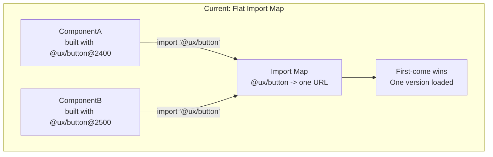
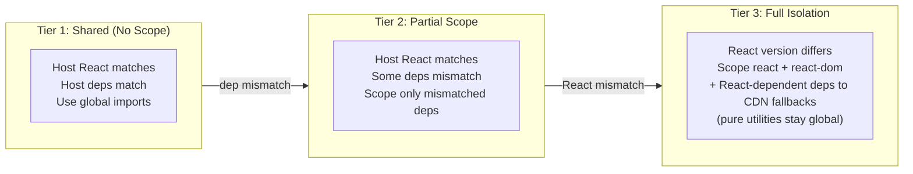
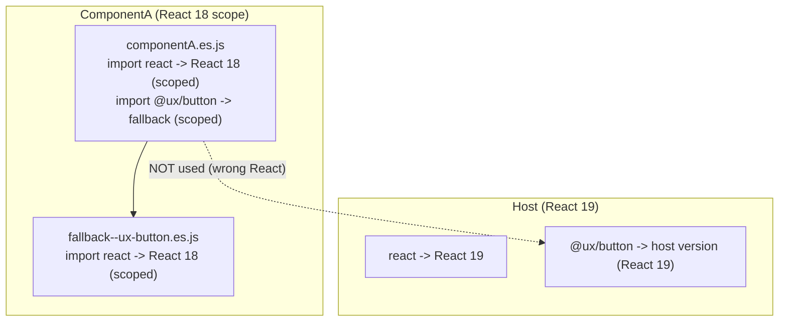
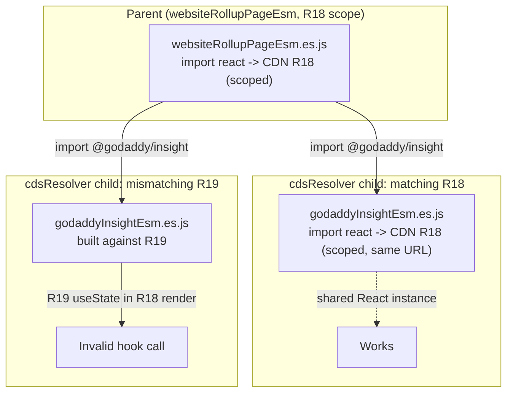
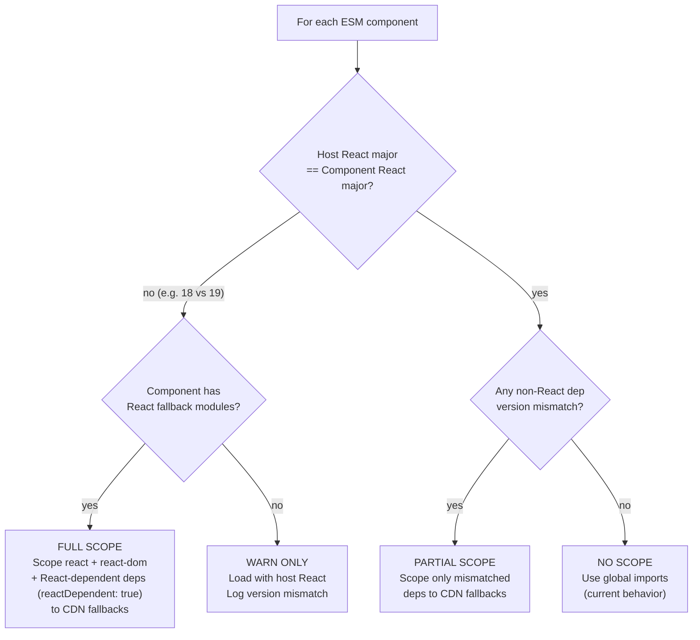
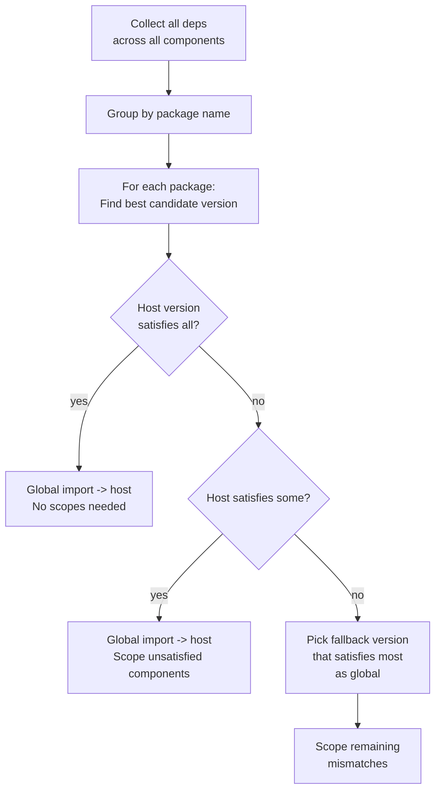
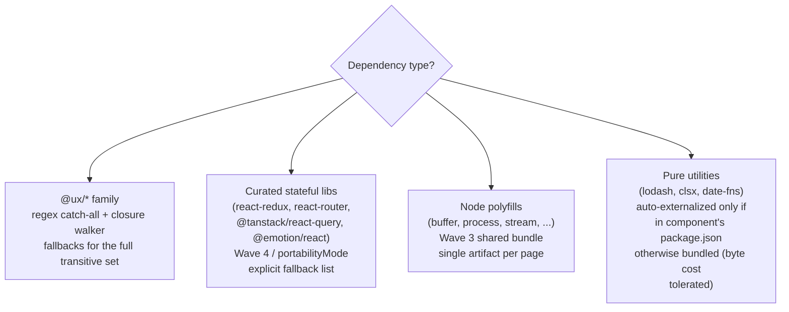
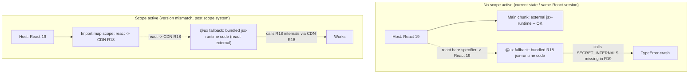
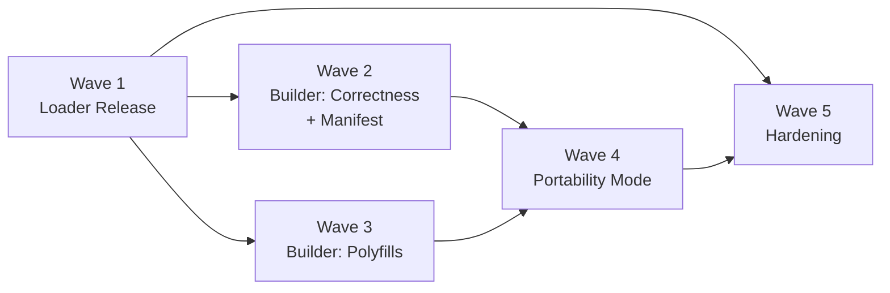

# ESM Dependency Version Isolation for CDS

## Why This Is Hard: The ESM Import Map Problem

In Node.js, version isolation is "free" -- each package gets its own `node_modules`, and the resolution algorithm walks up the directory tree. Two packages can depend on different versions of `lodash` without knowing or caring.

**ESM import maps are fundamentally different.** A bare specifier like `import '@ux/button'` resolves through a single, page-level lookup table: the import map's `imports` object. One specifier, one URL, one version -- globally. It is, by design, a flat namespace.



**Your current loader at [esm-loader.tsx](packages/cds-loader/src/loaders/esm-loader.tsx) line 1343:**

```typescript
if (importMap.imports[packageName]) {
  continue;  // <-- first mapping wins, everything else is silently ignored
}
```

This works when all components agree on versions. It breaks when they do not.

Import map **scopes** are the browser-native solution to this. They are the ESM equivalent of nested `node_modules` -- per-URL-prefix resolution overrides that let different code loaded from different URLs resolve the same bare specifier to different modules.

---

## The Three Tiers

Everything in this plan is in service of three operating modes, which the loader selects per-component at runtime based on version compatibility:



Tier 1 is an **optimization** that applies when host and component happen to be compatible. Tier 2 kicks in when UXCore versions drift. Tier 3 is the **portability guarantee**: every component can run at Tier 3 if needed, which means it can run on any host -- including a bare host with no React at all.

---

## Why Wasn't This a Problem in the Original (esbuild) CDS?

Fair question. CDS has shipped for years under the default `esbuild` engine (the `default:` branch in [build/index.js](packages/cds-cli/src/build/index.js) line 57-60) without any of the scope / hoisting / fallback-closure machinery this plan describes. What changed?

Short answer: **the esbuild engine sidesteps version isolation entirely by not doing module resolution in the browser at all.** ESM import maps force us to actually resolve bare specifiers, and that resolution is static. So everything the old engine got "for free" by not trying, the ESM engine has to engineer explicitly.

### The esbuild Engine: "`cds.foo`" Globals, Not Modules

The default engine produces an **IIFE** that attaches to `window.cds`. See [build/esbuild/build-core.js](packages/cds-cli/src/build/esbuild/build-core.js) lines 46-66 and 108-110:

```javascript
globals[key] = (name) => `cds.${camelCase(name)}`;
// ...
format: 'iife',
globalName: `cds.${type}`,
```

Every bare import the component doesn't bundle (`react`, `@ux/icon-v2`, `lodash`, etc.) is rewritten by `esbuild-plugin-globals` into a property lookup like `cds.react` or `cds.uxIconV2`. The host is expected to have already assigned those properties on `window.cds` via its deps script.

What this buys us, by *not* doing:

- **No module resolution in the browser.** Bare specifiers become JS property access. The browser never has to decide "which `react` does this import mean?" -- the build has already hardcoded it to `cds.react`, and whatever was last assigned there is what you get.
- **No version negotiation, because there is no version metadata.** `cds.react` is whatever the host dropped in. The component trusts it. If the versions don't match, *today's components tend to crash in ways that look like library bugs, not infra bugs* -- which is actually why this plan exists.
- **No duplicate-import conflict.** Because imports are property reads, importing `react` twice just reads the property twice. No "multiple React instance" warnings from an ESM loader. (The React runtime still warns if two actual React modules get loaded, but under esbuild there is only ever one.)

In practical terms, the esbuild engine's version isolation model is: **"there is no isolation, and there is no negotiation either; you get whatever global happened to be assigned, and everything is okay if the host and every component were built against compatible versions."** First-writer-wins on a global.

### Why That Worked Well Enough For Years

Under the `cds.foo` globals model, mismatches between the version a component was built against and the version the host actually provides are **silent** -- until something specific breaks:

- React was more forgiving about cross-version calls. React 18 hooks in a React 17 runtime mostly worked. React 19's removal of `__SECRET_INTERNALS_*` is the first really hard break in that chain.
- UXCore majors moved slowly enough that hosts and components tended to sit on the same major for long periods.
- Consumers were mostly a handful of aligned GoDaddy apps. "Just bump everyone together" was a viable operational strategy.
- Each component explicitly opted in to which packages became globals via `presets` / `skipped` (see `build-core.js` line 46-57). Anything surprising got bundled into the IIFE per-component -- duplication as a safety valve.

So: no real version isolation, no runtime negotiation, no clever sharing. The old engine got away with it because the ecosystem let it.

### WMFe Added Some Negotiation; WMF And Rollup Did Not

Later engines added more machinery, but none of them are the default:

- **`wmfe` (webpack Module Federation)**. The [generate-cds-dependencies.js](packages/cds-utils/src/generate-cds-dependencies.js) generator at line 208-217 emits:
  ```javascript
  'react': {
    lib: () => react,
    version: '18.3.1',
    shareConfig: { singleton: true, requiredVersion: '^18.0.0', eager: true }
  }
  ```
  MF's share scope inspects `version` / `requiredVersion` at load time, picks or rejects per semver. This is actual runtime negotiation -- but it has to be opted into per host.
- **`wmf`** is a predecessor with a similar but less capable share mechanism.
- **`rollup`** is a simpler bundle pipeline, similar in spirit to esbuild.

None of these is widely adopted across hosts. The default path -- and the path most consumers are on -- is still the esbuild globals model.

### Why ESM Can't Do What The esbuild Engine Does

The cute trick in esbuild-CDS is that **a bare import becomes a JS property access**. That is a build-time rewrite: the text `import React from 'react'` never survives to runtime; it has been turned into `var React = cds.react`.

ESM import maps can't do that. They are a *static*, *flat* URL→URL table, parsed by the browser before any module loads. No runtime, no property access, no conditional logic. Even scopes -- the closest thing to MF's share scopes -- are static, URL-prefix-keyed, decided at import-map-construction time.

| Capability | esbuild `cds.foo` globals | WMFe share scope | ESM import maps |
|---|---|---|---|
| Module resolution happens | At build time | At load time | At load time (URL lookup only) |
| Runtime version negotiation | None (last write wins) | Yes (semver) | No |
| Multiple versions coexisting | Only if hand-rolled | Yes (`singleton: false`) | Only via scopes, pre-decided |
| Handles host-absent case | Crash on undefined | Crash (no provider) | Must resolve to fallback URL or fail |
| Version-mismatch behavior | Silent | Warn / error per config | Undefined behavior |

The ESM engine in this plan is trying to do **more** than the esbuild engine ever did -- genuine per-component isolation, explicit fallbacks, semver-aware choice -- because real ESM modules in the browser force us to make all of that explicit. The esbuild engine never had to answer "which version?" because it answered "whatever's in `cds.react`" every time. ESM won't let us dodge the question.

### What Changed Recently That Forced The Issue

Even with the old tools we might have coasted longer, but a few pressures made the problem visible now:

1. **React 18 / 19 coexistence**. React 19 removed `__SECRET_INTERNALS_*`, hard-breaking fallback bundles built against React 18. React is also stricter about "invalid hook call" across instances.
2. **UXCore calendar majors moving fast**. 2400 → 2500 → 2600 in under a year. Hosts pin one; components get built against another; drift became the default.
3. **More hosts, more diverse**. Dozens of host apps with independent dep bumps, plus third parties embedding MFEs where CDS doesn't control the host at all.
4. **The portability goal itself is new**. The old engine assumed the host would provide everything via `cds.foo`. The new goal -- components that work on a bare host -- simply did not exist before.

### In Summary

- The esbuild engine "solved" version isolation by not resolving modules at runtime at all. `cds.foo` globals + first-writer-wins is the whole story.
- WMFe added real share-scope negotiation, but it's an opt-in engine used by a minority of hosts.
- ESM import maps are fundamentally a static URL table. They can't do what `cds.foo` did, and they can't do what MF does. They force us to pre-decide, at page-load time, every resolution the old engines deferred or evaded.

That's why this plan is so much more elaborate than anything the old engines needed.

---

## The North Star: Drop-Anywhere Portability

The ultimate goal of this work is that an ESM MFE built with CDS should be **runnable on any host**, regardless of what that host provides:

- Host with matching React 18 + matching UXCore versions: component shares everything (cheapest path)
- Host with a different React major: component uses its own scoped React
- Host with a different UXCore major: component uses its own scoped UXCore
- Host with no React at all: **component brings its own React and runs standalone**
- Host with no UXCore at all: component brings its own UXCore via fallbacks
- Host with partial UXCore coverage: component uses whatever the host has and fills gaps from its own fallbacks

This reframes how we think about tiers. Tier 3 (full isolation) is **not an escape hatch for exotic cases** -- it is the guarantee that every component can run on a bare host. Tier 1 and Tier 2 are optimizations we apply when the host happens to be compatible.

### What Portability Requires

A component is portable if and only if its **dependency closure is complete in its CDN prefix**. Concretely:

1. **Every externalized dependency has a fallback module** at `{cdnBaseUrl}/esm/{type}/`, including React, ReactDOM, and any stateful runtime (Redux, React Router, React Query, etc.) the component uses.
2. **The transitive closure of all `@ux/*` packages is externalized with fallbacks** -- no `@ux/*` code is ever silently bundled into another package's fallback (which would create duplicate, non-deduplicatable copies).
3. **The loader treats "host has no version of X" the same as "host has a wrong version of X"**: scope the component to its own fallback.
4. **The fallback bundles are self-consistent** -- if `fallback--ux-button.es.js` imports `react`, and the scope routes `react` to `fallback-react.es.js`, that React must be the one the fallback was built against.

### Current Gaps Relative to This Goal

| Requirement | Status | Fix |
|-------------|--------|-----|
| React/ReactDOM fallbacks | **Never built** -- `alwaysProvidedByHost` set | Always built in ESM mode (no flag needed) |
| Full transitive `@ux/*` closure externalized | Partial -- only direct deps + one level of peer deps | Recursive closure walker |
| Loader handles "host absent" | Partial -- required deps log a warning but don't fall back | Treat absence as mismatch |
| jsx-runtime consistent with chosen React | Broken (R18 inlined) | Phase 0 jsx-runtime fix |

The rest of the plan turns these gaps into concrete changes.

---

## Component Author Guidance

The strategy gives the platform tools to handle React version mismatches safely, but **components are still cheaper to operate when they match the host's React**. Authors should make a deliberate choice rather than treat React version as accidental.

### Default: Match Your Host Audience's React

If you know your component will primarily render inside hosts running React 18 (today, that's most of GoDaddy's host surface area), build against React 18. Concretely:

- The component shares the host's React instance instead of forcing the browser to download a scoped fallback
- No second React module in memory, no second reconciliation tree, no scope-cascade overhead for React-dependent fallbacks
- Hooks, context, and event delegation traverse the host/component boundary without ceremony

The same logic applies in reverse: if your component is built for a React 19 host (e.g. a future-state vnextDashboard), build against React 19.

**Recommendation for the current rollout**: build against **React 18** unless you have a hard requirement that demands React 19. Most hosts are R18 today; matching them keeps memory and bytes minimal.

### cdsResolver Families Must Align

If your component pulls in other CDS components via `cdsResolver`, every component in that chain must share a React major. The parent's React choice constrains every child. There is no scope-routing escape hatch -- React state is module-level, and a child's `useState` resolves to whichever React instance the child's scope routes to.

In practice this means: pick a React major for the **whole component family** before picking it for one component. Mixed-major families crash at the first hook call across the boundary.

### When Is a Newer React Worth the Cost?

If you genuinely need a React 19-only API (e.g. `use()`, server components in client mode, the new `<Form>` actions), build against React 19 and accept the trade-offs:

- The browser downloads a scoped React 19 module even when rendered in an R18 host
- All your React-dependent fallbacks (`@ux/*`, `react-redux`, `react-router`, etc.) are also scoped because they share the cascaded React URL prefix
- Your component's working memory footprint roughly doubles (two React reconciliation trees on the page instead of one)
- Hooks and context only traverse within your component subtree -- you cannot consume a context provided by an R18 host

These trade-offs are correct and safe; they just aren't free. The version isolation system makes the unsafe case work, but matching the host is still the cheaper path.

### Choosing Your Operating Tier

The strategy describes "The Three Tiers" -- Hosted, Mismatched, and Portable. As an author, you choose the tier you want to target by which fallbacks you ship and which `provided` deps you trust:

- **Hosted (cheapest)**: trust the host for React, ReactDOM, and shared deps. Match the host's React major. Ship minimal fallbacks.
- **Mismatched (auto-handled)**: build against any React major. The platform scopes your React and its dependents to CDN fallbacks when the host disagrees.
- **Portable (heaviest)**: build a self-contained component that ships every dep it needs as a fallback. Use this only if you genuinely need to render on hosts you don't control.

You don't have to declare your tier explicitly -- it emerges from your manifest. But thinking about which tier you're targeting is the simplest mental model for "should I add this fallback?" or "can I drop this `provided` claim?"

---

## Why React Versions Matter (And Why You Can Isolate Them)

React is a **stateful runtime**. It manages a reconciliation tree, hook state, and synthetic events. Two React instances on the same page are normally dangerous because:

- `useState` from React 18 throws "Invalid hook call" if rendered inside a React 19 tree
- Context from one React instance is invisible to the other
- Two ReactDOM instances fighting over the same DOM subtree corrupts state

**However** -- and this is the key insight for your case -- these problems only manifest when React instances *interact*. If each MFE component:

1. Renders into its own container element (CDS loader already does this)
2. Manages its own React tree via its own `createRoot` call
3. Never passes React elements or contexts across component boundaries

Then two React instances are just two independent applications sharing a browser tab. They do not interact. Hooks work within their own tree. Each ReactDOM manages its own DOM subtree. Event handlers work because React 17+ attaches events to the root container, not `document`.

**The cost is duplication** -- React is ~45KB gzipped. Loading two versions means ~90KB of React code. For most pages, this is acceptable. For pages loading many components with mixed versions, it adds up.

### The Scope Cascade Rule

Here is the critical constraint: **if a component gets a scoped React, all of its React-dependent dependencies must also use that scoped React.**

Why? Consider:

1. ComponentA needs React 18. Host has React 19.
2. Scope maps `react` -> React 18 for ComponentA's CDN prefix
3. ComponentA uses `@ux/button` from the host (data URL)
4. That host `@ux/button` was loaded at page level with React 19
5. Now `@ux/button` calls `useState` from React 19, but it is rendered inside ComponentA's React 18 tree

This breaks. The button's hooks live in React 19's fiber tree while React 18 is managing the DOM.

**The rule**: When a component needs a different React than the host, any dependency that **transitively imports React** must be scoped to a CDN fallback. Those fallback modules live at the component's CDN URL prefix, so the scope applies to them too. They were built alongside the component using the same `node_modules`, so they are internally consistent.

**Pure utility deps (no React dependency) are exempt.** A React-isolated component can still share the host's `lodash`, `axios`, `date-fns`, etc. -- these libraries have no React dependency and two copies on a page are completely harmless to avoid. The `reactDependent` field on each fallback dep entry in the manifest drives this distinction. When absent (legacy manifest), default to `true` (conservative -- same as scoping everything).



For the **common case** (host and component agree on React version), nothing changes. No scopes needed, host-provided deps are used, everything is deduplicated as it is today.

### cdsResolver: Nested CDS Components Share Their Parent's React

CDS components can declare `cdsResolver` entries to pull in other CDS components as dependencies. From the manifest of `websiteRollupPageEsm`:

```json
"cdsResolver": {
  "@godaddy/insight": "godaddyInsightEsm",
  "@godaddy/monetization-banner": "godaddyMonetizationBannerEsm",
  "@venture/website-module": "wsbventureWebsiteModuleEsm"
}
```

The loader walks these entries, fetches each child component's manifest, and writes import-map entries routing the parent's bare specifier (`@godaddy/insight`) to the child's main chunk URL (`bb1e828.godaddyInsightEsm.es.js`). The parent's code does `import { Insight } from '@godaddy/insight'` and gets the child's exports -- typically React components rendered inside the parent's tree.

**The constraint**: because cdsResolver children are imported as React components into the parent's render tree, parent and child must share the same React instance. There is no scope-routing trick that bridges this -- React's hook dispatcher is module-level state inside each React module. A child's `useState` call resolves to the React module its scope routes to; if that's a different React than the one the parent's render entered, you get an "Invalid hook call" crash.

**What S7 does (matching `reactVersion`)**: When parent and cdsResolver child carry the same `reactVersion`, the loader adds a scope entry for the child's CDN prefix routing `react` and `react-dom` to the same CDN URLs as the parent's scope. The browser deduplicates by URL, so both prefixes end up sharing one React module instance. Hooks work, contexts traverse, everything functions normally.

**What S7 does (mismatching `reactVersion`)**: When parent and cdsResolver child carry different `reactVersion` (e.g. parent is R18 and child is R19), there is no safe automatic fix. The loader emits a warning identifying the conflict and continues -- the page may crash at the first hook call into the child's components. Resolution is at the source: rebuild the child against a compatible React version, or rebuild the parent against the child's. See "Future Problems #9" for the dual-artifact escape hatch (build the child for both React majors).



**Practical guidance**: All components in a `cdsResolver` chain must share a React major. The parent's React version constrains every child it pulls. See "Component Author Guidance" for how this affects React-version choices for component families.

---

## The Solution: Import Map Scopes

### How Scopes Work

```json
{
  "imports": {
    "react": "data:...react-19...",
    "@ux/button": "data:...host-ux-button-2500..."
  },
  "scopes": {
    "https://cdn.example.com/esm/componentA/": {
      "react": "https://cdn.example.com/esm/componentA/fallback-react-18.es.js",
      "react-dom": "https://cdn.example.com/esm/componentA/fallback-react-dom-18.es.js",
      "@ux/button": "https://cdn.example.com/esm/componentA/fallback--ux-button.es.js"
    }
  }
}
```

When the browser (or es-module-shims) resolves `import 'react'`:

- If the importing module was loaded from `https://cdn.example.com/esm/componentA/...`, it checks scopes first. Match found. Returns React 18.
- If the importing module was loaded from anywhere else (host code, other components, data URLs), no scope matches. Returns the global React 19.

**This already works structurally** because your CDN layout is `{cdnBaseUrl}/esm/{type}/{files}` -- each component and all its fallback modules share a URL prefix.

### What Needs To Change

The beauty of the scopes approach is that **no build changes are needed to webpack or the externals function**. The component still emits `import '@ux/button'` and `import 'react'` -- clean, standard specifiers. All version isolation is handled at the loader level by constructing the right import map.

The changes are:

**1. Manifest: Record build-time versions** ([generate-registry.js](packages/cds-cli/src/build/esm/generate-registry.js))

The manifest needs to record what versions were installed at build time so the loader can make scope decisions. The changes must be **fully backward compatible** -- old loaders that have already been deployed cannot be updated simultaneously.

**Backward compatibility constraints:**
- Old loaders check `typeof info === 'string'` to recognize react/react-dom. Changing them to objects would silently break that check.
- Old loaders read `info.file` and `info.version` on fallback deps. They ignore unknown fields.
- Old loaders and host generators ignore unknown top-level fields on registry entries.

**Safe approach:** Keep react/react-dom as strings. Add React build version as a new **top-level** registry field. Add `built` as an extra field on fallback dep objects.

```json
{
  "myComponentEsm": {
    "js": "abc123.myComponentEsm.es.js",
    "engine": "esm",
    "reactVersion": "18.3.1",
    "dependencies": {
      "react": "^18.0.0",
      "react-dom": "^18.0.0",
      "@ux/button": {
        "file": "abc123.myComponentEsm.fallback--ux-button.es.js",
        "version": ">=2400.0.0 <2500.0.0",
        "built": "2400.16.0"
      },
      "@ux/modal": {
        "file": "abc123.myComponentEsm.fallback--ux-modal.es.js",
        "version": ">=2400.0.0 <2500.0.0",
        "built": "2400.12.0"
      }
    }
  }
}
```

What old loaders see:
- `react: "^18.0.0"` -- string, handled as before
- `@ux/button: { file, version, built }` -- reads `file` and `version`, ignores `built`
- `reactVersion: "18.3.1"` -- unknown top-level field, ignored

What new loaders read:
- `reactVersion` -- exact React version at build time, for scope decisions
- `built` on fallback deps -- exact installed version, for hoisting and scope decisions
- `version` (tightened from `*`) -- semver range, for compatibility checks

**2. Builder: Build React/ReactDOM fallback modules** ([build-fallback-modules.js](packages/cds-cli/src/build/esm/build-fallback-modules.js))

Currently, React and ReactDOM are in the `alwaysProvidedByHost` set and no fallbacks are built. In ESM mode, React isolation is always on -- no config flag needed. `react`, `react-dom`, and `react/jsx-runtime` are unconditionally removed from `alwaysProvidedByHost` and fallback modules are built for them alongside every other dependency.

**3. Loader: Build scopes** ([esm-loader.tsx](packages/cds-loader/src/loaders/esm-loader.tsx))

The core logic change. In `setupImportMap`, after collecting all ESM components and building the global `imports`, add a second pass that builds `scopes`:

```
for each ESM component:
  compare each dep's `built` field with host versions
  
  if React major version differs AND component has React fallbacks:
    -> FULL SCOPE: scope react, react-dom, and all React-dependent deps (reactDependent: true) to CDN fallbacks; pure utilities (reactDependent: false) stay on host globals
    
  else if any non-React dep version differs:
    -> PARTIAL SCOPE: scope only the mismatched deps to CDN fallbacks
    
  else:
    -> NO SCOPE: component uses global imports (current behavior)
```

The loader decision flow:



**Partial scope example** (same React, different UXCore):

```json
{
  "imports": {
    "react": "data:...react-19...",
    "@ux/button": "data:...host-2500..."
  },
  "scopes": {
    "https://cdn.../esm/componentA/": {
      "@ux/button": "https://cdn.../esm/componentA/fallback--ux-button.es.js"
    }
  }
}
```

ComponentA gets its own `@ux/button` (built with 2400) but shares the host's React 19. No duplication of React.

**Full scope example** (different React):

```json
{
  "imports": {
    "react": "data:...react-19...",
    "@ux/button": "data:...host-2500..."
  },
  "scopes": {
    "https://cdn.../esm/componentA/": {
      "react": "https://cdn.../esm/componentA/fallback-react.es.js",
      "react-dom": "https://cdn.../esm/componentA/fallback-react-dom.es.js",
      "@ux/button": "https://cdn.../esm/componentA/fallback--ux-button.es.js",
      "@ux/modal": "https://cdn.../esm/componentA/fallback--ux-modal.es.js"
    }
  }
}
```

ComponentA is fully isolated. All its imports resolve to its own CDN fallbacks. Its `@ux/button` fallback imports `react`, which resolves via the scope to React 18 -- internally consistent.

---

## Version Hoisting: Cross-Scope Deduplication

Scopes solve correctness. But naive scoping is wasteful -- if Component1 has `axios@1.23.0` and Component2 needs `axios@^1.22.0`, loading two copies of axios is pointless because `1.23.0` satisfies `^1.22.0`. The loader should be smart enough to hoist compatible versions to the global `imports` and only scope what truly cannot be shared.

### Prior Art

**Webpack Module Federation's share scope** is the closest existing implementation of this idea. When MF remotes register their shared dependencies, the share scope collects all registered versions and their `requiredVersion` semver ranges, then picks the highest compatible version at module-load time -- using `semver.satisfies` for the range checks and enforcing `singleton: true` for stateful libs like React.

The algorithm here is doing the same negotiation, but at **import-map-construction time** rather than at module-load time, because import maps are static and must be finalized before any module loads.

The key difference is what happens when no single version satisfies everyone:

| | npm `dedupe` | MF share scope | This algorithm |
|---|---|---|---|
| All satisfied | Hoist globally | Use single shared version | Hoist globally |
| Not all satisfied | Leave conflict, no hoist | Error / force highest (singleton) | Hoist best candidate, **scope the rest** |

npm dedupe is all-or-nothing. MF with `singleton: true` forces one version and warns on mismatches. This algorithm is the most flexible: hoist the most-compatible version globally, and let components that don't match fall through to scoped CDN fallbacks. That "scope the rest" escape hatch is what makes it work for import maps -- there is no MF-style runtime re-negotiation available after the map is committed.

The semver comparison logic (`semver.satisfies`) is standard and already a dependency of the loader package. MF's share scope negotiation source is public reference if the implementation needs cross-checking.

### The Algorithm

Before building the import map, the loader runs a **negotiation pass**:

```
1. COLLECT: For each component, for each dependency, gather:
   - range:    semver range from manifest (info.version or info.range)
   - built:    exact version from manifest (info.built)
   - fallback: CDN fallback URL (info.file, if present)

2. GROUP by package name across all components

3. NEGOTIATE: For each package:
   a. Gather candidate versions:
      - Host version (from deps-esm.js / __CDS_ESM_LIBS__)
      - Each component's built version (from info.built)
   
   b. For each candidate, count how many components it satisfies:
      - If range is specific (not "*"): use semver.satisfies(candidate, range)
      - If range is "*" or absent: use major version match against built
        (because "*" is lazy versioning -- the real constraint is
        what the component was built and tested against)
   
   c. Select the candidate that satisfies the most components.
      Prefer the host version on ties (avoids downloading anything).
      Prefer the newest version when all else is equal.

4. BUILD the import map:
   - Global imports: the hoisted version for each package
   - Scopes: only for components whose requirement the hoisted version cannot satisfy
```

### Concrete Example

```
Component1: axios built 1.23.0, range "^1.22.0"
Component2: axios built 1.22.5, range "^1.22.0"
Host:       axios 1.23.0

Candidates:
  1.23.0 (host)  -> satisfies Component1 (^1.22.0 ✓), Component2 (^1.22.0 ✓)  -> 2/2
  1.22.5 (comp2) -> satisfies Component1 (^1.22.0 ✓), Component2 (^1.22.0 ✓)  -> 2/2

Winner: 1.23.0 (host version, preferred on tie)
Result: Global imports -> host axios. No scopes. Zero duplication.
```

Another:

```
Component1: @ux/button built 2400.16.0, range "*"
Component2: @ux/button built 2500.2.0,  range "*"
Host:       @ux/button 2500.4.0

Since range is "*", fall back to major version comparison:
  2500.4.0 (host) -> Component1 built 2400 (major mismatch!), Component2 built 2500 (OK)  -> 1/2
  2400.16.0 (c1)  -> Component1 built 2400 (OK), Component2 built 2500 (major mismatch!)  -> 1/2

Winner: 2500.4.0 (host, preferred when tied)
Result: Global imports -> host @ux/button 2500.
        Scope for Component1 -> CDN fallback @ux/button 2400.16.0
```

Another:

```
Component1: lodash built 4.17.21, range "^4.17.0"
Component2: lodash built 4.17.21, range "^4.17.0"
Component3: lodash built 4.17.15, range "^4.17.0"
Host:       lodash 4.17.21

4.17.21 satisfies all three ranges -> hoist to global. Zero scopes.
```

### The "*" Version Problem

Many of your current manifests use `"version": "*"` for UXCore dependencies. `*` technically means "any version," but in practice a component built with `@ux/button@2400.16.0` will NOT work with `@ux/button@2500.x.x` -- the APIs may have changed.

The hoisting algorithm handles this with the **major version fallback rule**: when the declared range is `*`, compare the **major version** of the candidate against the major version the component was actually built with (from the `built` field on that dependency entry). Same major = compatible. Different major = incompatible.

This is why the `built` field in the manifest is critical. Without it, `*` means "anything goes" and you are back to first-come-wins with no safety net.

**Going forward**, the builder should also generate more specific version ranges instead of `*`. When `package.json` says `"@ux/button": "*"`, the builder should tighten it to `>=${MAJOR}.0.0 <${MAJOR+100}.0.0` (e.g., `>=2400.0.0 <2500.0.0`) based on the installed version. This makes hoisting decisions more reliable even for old manifests that lack `built` fields.



---

## Aggressive UXCore Externalization

### The Current Gap

The ESM builder externalizes UXCore packages from a **static list** sourced from `@ux/webpack-config`:

```javascript
// get-config.js lines 21-31
const uxcoreWebpackExternals = require('@ux/webpack-config').externals;
export const uxcoreExternals = Object.fromEntries(
  Object.entries(uxcoreWebpackExternals).map(([module, resolution]) => [
    module,
    resolution.root ? resolution.root : resolution
  ])
);

// these should be in the window, but they're not - don't externalize them
delete uxcoreExternals['@ux/text'];
delete uxcoreExternals['@ux/collapsible'];
```

Three problems with this:

1. **The list is incomplete.** If a component (or one of its dependencies) imports `@ux/somePkg` that is not in the list, it gets **bundled into the main chunk** -- no fallback module, no import map entry, no version management, no deduplication.
2. **UXCore peer dependencies aren't covered.** UXCore packages often have peer deps on other `@ux/*` packages. For example, `@ux/modal` might peer-depend on `@ux/button`, `@ux/icon`, and `@ux/text`. If the component does not directly import `@ux/icon` but `@ux/modal` pulls it in transitively, it may be bundled rather than externalized.
3. **For ESM, the static list provides no safety value.** The whole reason to gate externalization on a list was to ensure the host had the package available. With ESM fallback modules built per externalized package (see [build-fallback-modules.js](packages/cds-cli/src/build/esm/build-fallback-modules.js)), every externalized `@ux/*` package has a CDN fallback the loader can route to when the host doesn't provide it. The list is just a stale gate -- and the `delete uxcoreExternals['@ux/text']` / `['@ux/collapsible']` exclusions are legacy workarounds for a "we expected these on `window.ux` but they aren't there" bug that is now obsolete.

### The Fix: Drop The Static List, Use A Catch-All + Transitive Scan

Three changes to [get-config.js](packages/cds-cli/src/build/esm/get-config.js):

**0. Remove the `@ux/webpack-config` static-list import.**

Delete the `uxcoreWebpackExternals` import and the derived `uxcoreExternals` object (lines 21-31), including the `delete uxcoreExternals['@ux/text']` / `['@ux/collapsible']` exclusions. Delete the `addToExternals(externals, notExternalsSet, uxcoreExternals)` call in the `if (externalizeUXCore)` block (around lines 254-256). The `externalizeUXCore` option (default `true`) is preserved as an escape hatch -- it now gates whether the catch-all regex below is registered, not whether the static list is merged.

**1. Catch-all in the webpack externals function** (line ~413):

Currently the function only externalizes exact matches against `finalExternals`. Add a catch-all for any `@ux/*` base package, gated by `externalizeUXCore`:

```javascript
externals: [
  function ({ request }, callback) {
    // Bundle ALL @ux sub-paths (e.g., @ux/icon/chevron-down)
    if (request.match(/^@ux\/[^/]+\//)) {
      return callback();
    }

    // Check exact match against explicit externals
    for (const externalPkg of Object.keys(finalExternals)) {
      if (request === externalPkg) {
        return callback(null, request);
      }
    }

    // Catch-all for ANY @ux/* base package not in notExternals.
    // This replaces the legacy static-list gate from @ux/webpack-config.
    // Safe because every externalized @ux/* package has a CDN fallback module --
    // if the host does not have it, the fallback loads.
    if (
      externalizeUXCore &&
      request.match(/^@ux\/[^/]+$/) &&
      !notExternalsSet.has(request)
    ) {
      discoveredUxExternals.add(request);
      return callback(null, request);
    }

    callback();
  }
]
```

`discoveredUxExternals` is a Set that collects dynamically-discovered `@ux/*` packages during the build. After the webpack build completes, merge these into `finalExternals` so `buildFallbackModules` builds fallbacks for them too.

**2. Recursive transitive `@ux/*` closure walker:**

A single-level peer dep scan (walking `node_modules/@ux/*` once) is **insufficient**. UXCore has deep peer dep chains: `@ux/modal` peer-depends on `@ux/overlay`, which peer-depends on `@ux/focus-trap`, which peer-depends on `@ux/portal`. Missing any of these from externals means they get bundled -- often multiple times across different fallback modules -- producing large, duplicate, non-deduplicatable code.

The builder needs a **closure walker** that follows both `dependencies` and `peerDependencies` (and optionally `optionalDependencies`) recursively until a fixed point is reached:

```
Algorithm: buildUxClosure(rootPackages)
  closure = new Set()
  queue = [...rootPackages]       // direct @ux/* deps + discovered externals
  missingPeerDeps = []

  while queue is not empty:
    pkg = queue.shift()
    if pkg in closure: continue
    closure.add(pkg)

    // Resolve actual package.json location (handles npm, yarn, pnpm layouts)
    pkgJsonPath = resolvePackageJson(pkg, options.cwd)
    if not pkgJsonPath:
      missingPeerDeps.push({ pkg, reason: 'not-installed' })
      continue

    pkgJson = readJson(pkgJsonPath)

    // Walk ALL sources of @ux/* references in the package
    for each depName in {
      ...pkgJson.dependencies,
      ...pkgJson.peerDependencies,
      ...(portabilityMode ? pkgJson.optionalDependencies : {})
    }:
      if depName.startsWith('@ux/'):
        if not closure.has(depName):
          queue.push(depName)

  return { closure, missingPeerDeps }
```

Key behaviors:
- **Fixed-point termination**: the `closure` set guarantees no infinite loop on circular peer deps (which exist in UXCore).
- **Layout-agnostic resolution**: `resolvePackageJson` uses `require.resolve(`${pkg}/package.json`, { paths: [cwd] })` -- this works for npm (hoisted flat), yarn Berry (PnP), and pnpm (deeply nested symlinked) layouts.
- **Dependencies + peer deps**: not just peers. Some `@ux/*` packages list other `@ux/*` as direct `dependencies` (not peers), and those still need to be externalized.
- **Missing vs. installed**: packages that appear in `peerDependencies` but are not resolvable are recorded for the warning below, not added to externals.
- **Start from everything**: seed the queue with both direct `@ux/*` deps from the component's `package.json` AND the set discovered by webpack's runtime externals catch-all. The union guarantees coverage.

**Important**: The walker must **verify each package is actually installed** before adding it to externals. Peer deps may be missing when:
- The component uses `--legacy-peer-deps` or pnpm strict mode
- The peer dep is optional (`peerDependenciesMeta.optional: true`)
- A version conflict prevented auto-install

When missing peer deps are detected, emit a clear warning:

```
⚠ CDS ESM Build: Missing transitive peer dependencies

  The following @ux/* packages are listed as peerDependencies by your
  installed UXCore packages but are not installed in node_modules:

    @ux/icon     (peer dep of @ux/modal)
    @ux/text     (peer dep of @ux/modal, @ux/button)

  Because these packages are not installed:
    - No fallback module will be built for them
    - At runtime, if your component's code path reaches them
      (e.g. @ux/modal renders an @ux/icon), the call will fail
      unless every host that loads this component already provides them
    - You will not get version management or dedup for these packages
      via the CDS loader

  Recommended: install the missing packages:
    npm install @ux/icon @ux/text

  Alternative: if every host that loads this component is guaranteed
  to provide these packages, suppress this warning by adding them to
  hostProvided in cds.config.esm.js:
    hostProvided: ['@ux/icon', '@ux/text']
  This shifts responsibility to the host. If the host doesn't actually
  provide them at runtime, the component will crash.
```

This is a **warning**, not a build failure. If nothing in your component's reachable graph imports the missing peer dep at build time, the build proceeds without errors and the runtime risk only materializes if a code path inside the parent `@ux/*` package reaches into the missing peer (e.g. `@ux/modal` renders an `@ux/icon`). Note: `notExternals` is not a valid remediation here -- it tells the builder "bundle this instead of externalizing," but webpack still has to resolve the package from `node_modules` to bundle it, and the package is missing by definition.

**3. Propagating discovered externals to fallback builder:**

After `buildCore` completes, merge `discoveredUxExternals` into `options.externals` before calling `buildFallbackModules`. The existing `build-core.js` already writes `options.externals = finalExternals` -- just ensure the discovered set is included.

The fallback builder should also **pre-check resolvability** before attempting each build. If `require.resolve(packageName)` fails, skip that package and log:

```
⚠ Skipping fallback module for @ux/icon: package not resolvable from node_modules.
  If this package is needed at runtime, install it: npm install @ux/icon
```

This prevents cryptic webpack resolution errors from reaching the developer.

### The Host Coverage Problem

The user notes that different hosts provide different sets of UXCore components. This is exactly why every externalized `@ux/*` package **must** have a fallback module. The current system already handles this -- if a dependency is externalized and has a fallback, the loader uses the host's version when available and the CDN fallback when not.

The danger is externalizing a `@ux/*` package WITHOUT building a fallback. This would happen if the package ends up in `hostProvided` or if the fallback build fails. Safeguards:

- **Never put `@ux/*` packages in `hostProvided`** unless you are certain ALL target hosts provide them. The `hostProvided` list should be reserved for genuinely universal packages (`react`, `react-dom`).
- **Log and warn on fallback build failures** -- the current code catches build errors but continues. If a `@ux/*` fallback fails, it should be a prominent warning because the component will break on hosts that do not provide it.
- **The manifest should distinguish "externalized with fallback" from "externalized without fallback"** so the loader can make informed decisions. Currently both cases exist but are not clearly differentiated.

### Out Of Scope: wmf and wmfe

The static-list removal applies **only to the ESM build pipeline**. The wmf and wmfe pipelines ([packages/cds-cli/src/build/wmf/build-core.js](packages/cds-cli/src/build/wmf/build-core.js) and [packages/cds-cli/src/build/wmfe/build-core.js](packages/cds-cli/src/build/wmfe/build-core.js)) keep importing `@ux/webpack-config` and using its static `uxcoreExternals` list. Reason: those pipelines emit UMD bundles that expect `window.ux.<Component>` globals -- there is **no fallback module** safety net. Removing the static-list gate there would crash components on hosts that don't expose a given `@ux/*` package on `window.ux`.

The `@ux/webpack-config` dependency therefore remains in [packages/cds-cli/package.json](packages/cds-cli/package.json); the ESM code path simply stops using it.

---

## How `@ux/*` Differs From Other Externals

`@ux/*` is treated as a special case throughout the strategy. This section pulls the contrast together in one place so the asymmetry is explicit rather than scattered across sections.

### What gets externalized in each path



### Three concrete asymmetries

**1. Discovery: graph traversal vs. flat list.**

- Non-`@ux/*`: only what's in the component's `package.json` (or explicitly added via `cdsResolver` / `hostProvided` / `sharedDependencies`) becomes an external. If a direct dep peer-depends on something the component author didn't list, that something is invisible to externalization.
- `@ux/*`: webpack's regex catches every `@ux/*` import as it traverses code, regardless of whether it's in `package.json`. Plus the closure walker walks the `@ux/*` peer-dep graph at config time so the fallback builder knows the full closure to build for.

**2. Transitive coverage: explicit vs. recursive.**

- Non-`@ux/*`: zero transitive handling. If `framer-motion` is a peer dep of `@ux/modal` and isn't in the component's `package.json`, it's not externalized -- it gets bundled into `fallback-@ux-modal.es.js`. If two of the component's `@ux/*` deps both peer-depend on `framer-motion`, it ships twice in two different fallbacks with no way to dedupe.
- `@ux/*`: the closure walker keeps walking until fixed point. Every `@ux/*` package in the transitive graph gets externalized and gets its own fallback module, so there's exactly one copy per CDN prefix per package.

**3. Runtime dedup story: managed vs. accidental.**

- Non-`@ux/*`: dedup only happens for things that ended up in `finalExternals` (i.e. listed in the component's `package.json`). Those go through the import map and get the host-or-fallback treatment. Anything that got bundled (because it wasn't in any externals list) is a private copy with no negotiation.
- `@ux/*`: every package the regex caught is in `finalExternals`, so every `@ux/*` package goes through the import map. The catch-all + closure walker together guarantee `@ux/*` is fully managed at runtime.

### Why the asymmetry exists

`@ux/*` earns special-case treatment for legitimate reasons:

- **Volume.** A typical component pulls dozens of `@ux/*` packages. Duplication across components is the dominant byte cost.
- **Calendar versioning + drift.** `@ux/*` versions move fast (2400 -> 2500 -> 2600 in under a year). Cross-component dedup matters because hosts and components frequently sit on different majors.
- **Reliable peer-dep convention.** UXCore packages reliably express their `@ux/*` deps via `peerDependencies`. The closure walker is feasible because the convention is stable. There's no equivalent convention for the rest of npm.
- **Stateful-ish behavior.** Many `@ux/*` components carry CSS, register portals, or otherwise behave badly when duplicated. Dedup isn't just about bytes.

### What the asymmetry costs

The non-`@ux/*` path has known gaps that the early waves deliberately don't close:

1. **Stateful non-`@ux/*` libraries** (Redux store, React Router, React Query) bundled into one fallback would cause "two stores" bugs the same way two Reacts would. Wave 4 / `portabilityMode` handles this by extending the fallback-build set to a curated allowlist of stateful runtimes (`react-redux`, `react-router`, `@tanstack/react-query`, `@emotion/react`). It's not a generalization of the closure walker -- it's a hand-maintained list.
2. **Pure utilities** (lodash, clsx, date-fns) bundled into multiple fallbacks just cost bytes. The strategy currently tolerates this. There's no analog of the closure walker for arbitrary npm packages because there's no reliable graph signal -- people declare these as `dependencies`, not `peerDependencies`, and there's no convention to walk.
3. **Polyfills** (Buffer, process, stream-browserify, ...) had the same per-fallback duplication problem at much larger scale. Solved separately by the **shared polyfill bundle** (Wave 3) which short-circuits this for the specific case of Node-API polyfills.

### Implication for component authors

If your component pulls in a non-`@ux/*` library that is a peer dep of one of your direct deps but not in your `package.json`, that library will silently be bundled into a fallback module. This is fine for stateless utility libraries (you pay byte cost, no behavioral risk) but **not** fine for stateful runtime libraries -- those need to either go in your `package.json` (so they're externalized + fallback'd) or be picked up by the curated stateful-runtimes list when `portabilityMode` is on.

The general principle: anything stateful at runtime should be **explicit** in your `package.json` or in the platform's curated allowlist. The platform doesn't auto-discover stateful behavior outside the `@ux/*` graph.

---

## Portability Mode: Building for Bare Hosts

To deliver on the drop-anywhere promise, the builder needs a mode that guarantees every externalized dependency has a fallback. This removes the implicit "host will provide React" assumption.

### Build Config

```javascript
// cds.config.esm.js
module.exports = {
  portabilityMode: true
};
```

React/ReactDOM fallbacks are always built in ESM mode (no flag needed). `portabilityMode` extends that to stateful runtime libraries:

When `portabilityMode: true`:

1. **React, ReactDOM, and `react/jsx-runtime` fallbacks already built** (unconditional in ESM mode -- no change here).
2. **Other stateful runtimes are detected and get fallbacks** -- `react-redux`, `react-router`, `react-router-dom`, `@tanstack/react-query`, `@emotion/react`, etc. Any package that holds runtime state or binds to React counts.
3. **The full transitive `@ux/*` closure is externalized with fallbacks** (see recursive closure walker above).
4. **A portability audit runs at the end of the build**: it verifies that every bare specifier in every emitted chunk (main + fallbacks) either has an entry in the manifest or is a declared-neutral utility. Anything else is a build error.

### The Portability Audit

After the build, parse each emitted `.es.js` file and extract all `import` specifiers. For each specifier:

- If the specifier is in the manifest's `dependencies` (required or fallback), it is covered.
- If the specifier is declared neutral (no runtime state, safe to bundle multiply -- e.g. `lodash.camelcase`, `tslib`), it is acceptable.
- Otherwise, **fail the build** with a clear message identifying which chunk imports what uncovered specifier.

This prevents silent regressions where a new transitive import leaks into the bundle without being externalized.

### Loader: Treating "Host Absent" As A First-Class Case

Today, the loader's flow for a required dependency (line ~1349) is:

```typescript
const hostHasDependency = window.__CDS_ESM_LIBS__[packageName] || (deps && deps[packageName]);
if (hostHasDependency) {
  providedByHost++;
} else {
  missingRequired++;
  warnings.push(`❌ ${packageName}: NOT PROVIDED by host...`);
}
```

"Not provided" is treated as an error to be logged. For portability, it must be treated as a **scope trigger**: the component needs its own CDN fallback for that specifier, exactly as if the host had the wrong version.

Updated logic:

```
For each dependency of the component:
  if host provides it at a compatible version:
    use host (hoist to global imports)
  else if host provides it at an incompatible version:
    scope to CDN fallback
  else (host does not provide it at all):
    if component has a fallback module:
      scope to CDN fallback  <-- NEW: treat absence like mismatch
    else:
      error: dependency has no fallback and host does not provide it
```

This means a portable MFE on a bare host produces an import map where **every specifier the component uses is scoped to the component's own CDN fallbacks**. Effectively Tier 3, triggered automatically by absence rather than version mismatch.

### Redux, React Router, and Other Stateful Libraries

React is not the only library with runtime-instance concerns. Any library with singleton runtime state has the same problem:

- **Redux / react-redux**: the store is runtime state, and `<Provider>` uses React context. Two `react-redux` instances with different React versions will fail the same way as two React instances. Solution: treat `react-redux` identically to React -- it moves into the fallback closure.
- **React Router**: uses React context for navigation. Same treatment.
- **React Query**: `QueryClient` is runtime state. Same treatment.
- **@emotion/react, styled-components**: use React context for theming, plus a runtime cache. Same treatment.

The `portabilityMode` flag should detect these from `package.json` dependencies and include them in the fallback closure automatically. A curated list plus user-extensible `statefulRuntimes` config option covers both known cases and future ones.

---

## Required Changes Summary

### Builder ([packages/cds-cli/src/build/esm/](packages/cds-cli/src/build/esm/))

1. **[get-config.js](packages/cds-cli/src/build/esm/get-config.js)**: Remove the `@ux/webpack-config` static externals import (lines 21-31) and the `addToExternals(...uxcoreExternals)` call (lines 254-256), including the legacy `delete uxcoreExternals['@ux/text']` / `['@ux/collapsible']` workaround exclusions. Add catch-all `@ux/*` base package externalization in the webpack externals function, gated by the existing `externalizeUXCore` option (default `true`) so the option still works as an escape hatch (when `false`, `@ux/*` packages are bundled). Add recursive transitive `@ux/*` closure walker (dependencies + peerDependencies, fixed-point termination, layout-agnostic resolution). Propagate discovered externals for fallback building. Tighten `*` version ranges to major-version ranges based on installed versions. Emit warning listing any `@ux/*` peer deps that are not installed. **wmf and wmfe pipelines unchanged** -- they still rely on `window.ux` globals and need the static list.

2. **[generate-registry.js](packages/cds-cli/src/build/esm/generate-registry.js)**: Add top-level `reactVersion` field (exact installed React version). Add `built` field to fallback dependency objects. Add `reactDependent` boolean field to fallback dependency objects -- determined by scanning each built `.es.js` fallback artifact for `from 'react'`/`from 'react-dom'` external imports (`true` for React-using packages, `false` for pure utilities). Tighten `*` version ranges to major-version ranges based on installed version. Keep react/react-dom dependency strings unchanged for backward compatibility with deployed loaders.

3. **[build-fallback-modules.js](packages/cds-cli/src/build/esm/build-fallback-modules.js)**: Fix jsx-runtime inlining -- add `react/jsx-runtime`, `react/jsx-dev-runtime`, `react-dom/client` to externals; convert externals to a function with a `PATH_TO_BARE` table that catches file-path-resolved modules from CJS chains (generalized for both React and polyfill modules). Accept the full `@ux/*` closure from the walker and build fallbacks for every package. Pre-check resolvability before each fallback build and skip/warn if not resolvable. Remove `react`/`react-dom`/`react/jsx-runtime` from the `alwaysProvidedByHost` skip list unconditionally in ESM mode. When `portabilityMode: true`, also detect stateful React libraries (`react-redux`, `react-router`, `react-router-dom`, `@tanstack/react-query`, `@emotion/react`, etc.) and build fallbacks for them. **Externalize Node polyfill specifiers** (`buffer`, `process`, `process/browser`, `stream`, `crypto`, `util`, `events`, `path`, `querystring`, `url`, `punycode`) and **remove `NodePolyfillPlugin` + `ProvidePlugin` from fallback builds** -- polyfills come from the shared bundle via the import map. Audit CSS output for global rules and `@keyframes` names, emitting warnings when found.

4. **Polyfill bundle as a per-component build target**: Emit `{hash}.{type}.polyfills.es.js` as part of every ESM component build alongside the main chunk and fallback modules. Content: bundled `buffer`, `process/browser`, `stream-browserify`, `crypto-browserify`, `util`, `events`, `path-browserify`, `querystring-es3`, `url`, `punycode` with named exports. Self-contained (no externals). Uses the existing upload pipeline -- no separate deploy infrastructure. Record the filename in the component's registry entry as a top-level `polyfills` field. Size-minimize aggressively.

5. **Portability audit step**: After the build, verify every bare-specifier import in every emitted chunk has a manifest entry, is a known polyfill, or is declared neutral. Fail the build on uncovered specifiers with a clear message.

### Loader ([packages/cds-loader/src/loaders/esm-loader.tsx](packages/cds-loader/src/loaders/esm-loader.tsx))

1. **Manifest parsing + activation detection**: Define `EnrichedRegistryEntry` and `EnrichedDependency` TypeScript interfaces documenting the new optional manifest fields (`reactVersion`, `built`, `polyfills`). Implement `hasEnrichedManifests(esmComponents)` which returns `true` when any component carries `reactVersion` or any fallback dep carries `built`. All new behavior below (items 2-6) is gated behind this check -- when it returns `false`, the existing first-come-wins loop (the current `setupImportMap` dep-processing block) runs unchanged.

2. **Treat "host absent" as scope trigger**: In the new code path, for required deps not provided by the host, if the component has a fallback module, scope the component to use it. Only error if no fallback exists. (No-op on current manifests -- required deps don't carry fallback files until portability mode.)

3. **Pick one polyfill bundle, wire polyfill specifiers to it**: Implement `selectPolyfillBundle(esmComponents)` in `setupImportMap`. Add entries like `importMap.imports['buffer'] = '${chosenPolyfillUrl}#buffer'` for every polyfill specifier. Install `globalThis.Buffer` and `globalThis.process` once from the bundle before executing any fallback (Option A shim). No-op when no component's manifest carries a `polyfills` field.

4. **Version hoisting / negotiation pass**: In the new code path, collect all deps across ESM components, group by package name, and pick the candidate version satisfying the most components (preferring host on ties). Replaces the current first-come-wins loop when enriched manifests are present.

5. **Scope builder**: After hoisting, construct `importMap.scopes` keyed by component CDN URL prefix (`${cdnBaseUrl}/esm/${componentType}/`). Only add scope entries for packages where the hoisted version does not satisfy the component's requirements. Legacy path produces a flat `imports`-only map as today.

6. **Selective scope cascade**: When React version mismatch (or absence) is detected and fallbacks exist, scope all deps where `reactDependent: true` (or field absent) to CDN fallback URLs. Deps where `reactDependent: false` (pure utilities) continue to resolve from global host imports -- no download needed. Same cascade applies to other stateful runtimes (`react-redux`, etc.). Polyfills stay global -- they are stateless and safely shared across all scopes. **For `cdsResolver` nested CDS components with matching `reactVersion`**: also add a scope entry for the nested component's CDN prefix routing React to the same version. **For mismatching `reactVersion`**: emit a clear warning identifying the parent and nested component; do not attempt to force an incompatible React version.

7. **Runtime semver check**: For each dependency, compare candidate versions using `semver.satisfies` for specific ranges, and major-version comparison when range is `*` or missing (using the `built` field as ground truth). `semver` is already a dependency of the loader package.

### Host Generator ([packages/cds-utils/src/generate-cds-dependencies.js](packages/cds-utils/src/generate-cds-dependencies.js))

1. **Expose version metadata**: The `deps-esm.js` already includes `{ module, version }` per dependency. No structural change needed. The loader uses the `version` field for comparison.

---

## Manifest Evolution

Current:

```json
{
  "myComponentEsm": {
    "js": "abc.myComponentEsm.es.js",
    "engine": "esm",
    "dependencies": {
      "react": "^18.0.0",
      "react-dom": "^18.0.0",
      "@ux/button": { "file": "abc.fallback--ux-button.es.js", "version": "*" }
    }
  }
}
```

Proposed (fully backward compatible with deployed loaders):

```json
{
  "myComponentEsm": {
    "js": "abc.myComponentEsm.es.js",
    "engine": "esm",
    "reactVersion": "18.3.1",
    "dependencies": {
      "react": "^18.0.0",
      "react-dom": "^18.0.0",
      "@ux/button": {
        "file": "abc.fallback--ux-button.es.js",
        "version": ">=2400.0.0 <2500.0.0",
        "built": "2400.16.0",
        "reactDependent": true
      },
      "@ux/modal": {
        "file": "abc.fallback--ux-modal.es.js",
        "version": ">=2400.0.0 <2500.0.0",
        "built": "2400.12.0",
        "reactDependent": true
      },
      "lodash": {
        "file": "abc.fallback-lodash.es.js",
        "version": ">=4.17.0 <5.0.0",
        "built": "4.17.21",
        "reactDependent": false
      }
    }
  }
}
```

Changes from current:
- New top-level `reactVersion` field (ignored by old loaders)
- Fallback deps gain `built` and `reactDependent` fields (ignored by old loaders, used by new loaders for hoisting/scoping/cascade)
- `reactDependent` is determined at build time by scanning the built fallback artifact for `from 'react'`/`from 'react-dom'` external imports -- `true` for `@ux/*` and other React-using packages, `false` for pure utilities
- `version: "*"` tightened to major-version ranges (old loaders that check semver still work; `*` is a valid superset)
- `react`/`react-dom` strings **unchanged** (critical for backward compatibility)
- When `reactDependent` is absent (old manifest), loader defaults to `true` -- conservative cascade, same as before

If `built`/`reactVersion` fields are absent (old manifest), the new loader falls back to current behavior (no scopes, first-come-wins). New manifests get scope-based isolation automatically. Old loaders ignore the new fields entirely.

---

## The React 19 / jsx-runtime Fallback Problem

### What Is Happening Today

CDS builds CDN fallback bundles for `@ux/*` packages that host apps do not provide via the deps file. These fallback bundles are **not** React-version-agnostic -- they bundle `react/jsx-runtime` internally from whichever React version was installed at CDS build time (currently React 18).

React 18's jsx-runtime accesses `react.__SECRET_INTERNALS_DO_NOT_USE_OR_YOU_WILL_BE_FIRED.ReactCurrentOwner`. React 19 removed this property entirely. Any fallback bundle containing React 18's compiled jsx-runtime crashes on a React 19 host with `TypeError: Cannot read properties of undefined (reading 'current')`.

### Why Webpack Externals Do Not Catch It

The fallback builder externalizes `react` and `react-dom`, but `react/jsx-runtime` is a sub-path import and not covered by those declarations. Additionally, transitive CJS `require()` chains can resolve `react/jsx-runtime` to the file path `node_modules/react/jsx-runtime.js` -- a file-path resolution that bypasses externals entirely since the externals check only matches bare specifiers.

**`conditionNames` and how it affects this:** When webpack resolves a package, it consults `package.json` `exports` conditions in order. `conditionNames: ['import', 'module', 'default', 'require']` tells webpack to prefer the `import` or `module` condition first, which points to the package's `.mjs` ESM entry. That ESM entry imports `react/jsx-runtime` as a bare specifier — something the externals map can match. The previous configuration resolved some packages through their CJS entry instead, which caused `react/jsx-runtime` to be resolved to a file path like `node_modules/react/cjs/react-jsx-runtime.development.js`. File-path resolutions bypass the externals check entirely, so the module got bundled. The fallback builder now uses uniform `conditionNames: ['import', 'module', 'default', 'require']` for all packages, resolving them via their ESM entries and eliminating the file-path bundling issue. The remaining fix (S10) adds `react/jsx-runtime` explicitly to externals and adds the `PATH_TO_BARE` table to catch any file-path-resolved React modules that still slip through via other CJS chains.

### Which Delivery Layers Are Affected

#### Before: current state (no scope system, pre-S10)

| Delivery layer | R18 comp / R18 host | R18 comp / R19 host | R19 comp / R18 host | R19 comp / R19 host |
|---|---|---|---|---|
| Main ESM component chunk (jsx-runtime externalized) | Works | Works | Works ¹ | Works |
| Dep served from host `deps-esm.js` | Works | Works | Works | Works |
| CDN fallback — React-dependent pkg (`reactDependent: true`) | Works | **Downloads CDN fallback, crashes at execution** ² | **Downloads CDN fallback, crashes at execution** ³ | Works |
| CDN fallback — React-agnostic pkg (lodash, axios, …) | Works | Works | Works | Works |

The failure only affects CDN fallback modules for packages that **transitively depend on React** (`reactDependent: true`). Pure utility fallbacks carry no jsx-runtime and are always safe.

**Workaround until scope system ships**: React 19 hosts must ensure all React-dependent packages are provided via `deps-esm.js` so no CDN fallback for those packages is ever loaded. React-agnostic fallbacks are safe to load from CDN at any time.

**Footnotes:**

1. Without scope isolation, the main chunk receives the host's React 18. Works if the component only calls APIs present in both versions. If R19-specific APIs (`use()`, `useOptimistic()`, etc.) are called, the component crashes — an authoring concern, not a loader concern. Once the scope system ships, the component gets CDN React 19 via the scope and this caveat disappears (see footnote 4 in the "After" table).
2. The fallback chunk has R18's jsx-runtime code bundled. At execution it calls `__SECRET_INTERNALS_DO_NOT_USE_OR_YOU_WILL_BE_FIRED`, a symbol removed in React 19. The crash happens because the host's React 19 is the only `react` in scope and it no longer exports that symbol.
3. Symmetric: the fallback chunk has R19 jsx-runtime code bundled, which calls R19-only internals absent from React 18.

#### After: scope system ships (S6/S7 + S14/S15 enriched manifests)

| Delivery layer | R18 comp / R18 host | R18 comp / R19 host | R19 comp / R18 host | R19 comp / R19 host |
|---|---|---|---|---|
| Main ESM component chunk | Works | Works | Works ⁴ | Works |
| Dep served from host `deps-esm.js` | Works | Works | Works | Works |
| CDN fallback — React-dependent pkg | Works | **Works** ⁴ | **Works** ⁴ | Works |
| CDN fallback — React-agnostic pkg | Works | Works | Works | Works |

4. When `reactVersion` in the manifest does not match the host, an import-map scope is applied for the component's CDN URL prefix. This scope routes `react` and `react-dom` to the CDN version matching the component's build — for both the main chunk and its CDN fallbacks. A R19 component on an R18 host gets CDN React 19 via the scope; it never touches the host's React 18. The bundled jsx-runtime code still externalizes `react` internally (webpack only inlines the function bodies), so those calls are also covered by the scope. The component and all its React-dependent CDN fallbacks run on their build-time React, fully isolated from the host version.

**S10 additionally fixes** (belt-and-suspenders): when `react/jsx-runtime` is an explicit external in fallback builds, the jsx-runtime module itself routes through the import map cleanly instead of running bundled code. This is valuable for same-React-version deployments where no scope is activated, and makes the architecture easier to reason about long-term.

### Relationship to Import Map Scopes

Import map scopes (the rest of this plan) solve **which URL** each bare specifier resolves to at runtime. They are also the **primary fix** for the jsx-runtime crash in version-mismatch scenarios.

When the scope system detects `reactVersion: "18"` against a React 19 host, it adds an import-map scope routing `react` → CDN R18 for the component's URL prefix. The bundled jsx-runtime code externalizes `react` internally (webpack only inlines the function bodies, not the React object), so those calls also resolve through the scope to CDN R18. The crash is prevented.

The jsx-runtime inlining problem remains a **single-React-version concern** when no scope is activated: if a host and component share the same React major version, no scope is applied, but CDN fallback builds still have jsx-runtime code bundled. For same-version deployments this is benign (same React internals). S10 makes this clean regardless by making `react/jsx-runtime` an explicit external.



### Fix: Externalize react/jsx-runtime in Fallback Builds

The root cause is that `react/jsx-runtime` is not in the externals map and the CJS file-path resolution bypasses externals matching. The fix targets [`build-fallback-modules.js`](packages/cds-cli/src/build/esm/build-fallback-modules.js) `makeFallbackWebpackConfig`:

**1. Add `react/jsx-runtime` and `react/jsx-dev-runtime` to the externals map:**

```javascript
const fallbackExternals = {
  'react': 'react',
  'react-dom': 'react-dom',
  'react/jsx-runtime': 'react/jsx-runtime',
  'react/jsx-dev-runtime': 'react/jsx-dev-runtime',
  'react-dom/client': 'react-dom/client'
};
```

**2. Convert the externals object to an externals function** that catches file-path-resolved React modules (and, with the same mechanism, file-path-resolved polyfill modules):

```javascript
// Map of node_modules folder names -> bare specifier to externalize to
const PATH_TO_BARE = [
  [/node_modules[\\/]react[\\/]jsx-runtime\.js/, 'react/jsx-runtime'],
  [/node_modules[\\/]react[\\/]jsx-dev-runtime\.js/, 'react/jsx-dev-runtime'],
  [/node_modules[\\/]react-dom[\\/]client\.js/, 'react-dom/client'],
  [/node_modules[\\/]react-dom[\\/]/, 'react-dom'],
  [/node_modules[\\/]react[\\/]/, 'react'],
  [/node_modules[\\/]buffer[\\/]/, 'buffer'],
  [/node_modules[\\/]process[\\/]/, 'process/browser'],
  [/node_modules[\\/]stream-browserify[\\/]/, 'stream'],
  [/node_modules[\\/]crypto-browserify[\\/]/, 'crypto'],
  [/node_modules[\\/]util[\\/]/, 'util'],
  [/node_modules[\\/]events[\\/]/, 'events']
];

externals: [
  function ({ request }, callback) {
    // Exact match against known externals (React, polyfills, @ux/*, etc.)
    if (fallbackExternals[request]) {
      return callback(null, fallbackExternals[request]);
    }
    // Catch file-path-resolved modules that should have stayed external
    // (CJS require chain that resolves bare specifiers to absolute paths)
    for (const [pattern, bare] of PATH_TO_BARE) {
      if (pattern.test(request)) {
        return callback(null, bare);
      }
    }
    callback();
  }
]
```

The same mechanism that fixes jsx-runtime also fixes polyfills: any `crypto` or `buffer` that gets path-resolved through the CJS chain is remapped back to its bare specifier so it hits the import map.

**3. Alternatively or additionally, add a webpack resolve alias** that forces `react/jsx-runtime` to resolve to the bare specifier rather than a file path:

```javascript
resolve: {
  alias: {
    'react/jsx-runtime': 'react/jsx-runtime',
    'react/jsx-dev-runtime': 'react/jsx-dev-runtime'
  }
}
```

**Success criterion**: The built fallback bundle contains **no** bundled `__SECRET_INTERNALS_DO_NOT_USE_OR_YOU_WILL_BE_FIRED` from React. The jsx-runtime import appears as an external `import ... from "react/jsx-runtime"` in the output, just like the main ESM component chunk.

### Current Workaround (Until Fix Ships)

React 19 hosts must provide **all** needed `@ux/*` packages via the deps file so CDS never loads any CDN fallback bundles. React 18 hosts need no workaround. This aligns with Phase 1 of the migration path below -- manifest `reactVersion` field gives visibility into which components were built against which React.

### Optional Fallback: Dual (Major-Keyed) Fallback Artifacts

If the externalization fix above proves insufficient for some edge cases (e.g. deeply nested CJS chains that cannot be reliably intercepted), the builder can produce **two** fallback artifacts per package, keyed by host React major:

```json
{
  "@ux/button": {
    "file": "abc.fallback--ux-button.es.js",
    "fileReact19": "abc.fallback--ux-button.react19.es.js",
    "version": ">=2400.0.0 <2500.0.0",
    "built": "2400.16.0"
  }
}
```

The loader selects the file matching `React.version` major. Old loaders ignore `fileReact19` and use `file` (React 18, current behavior). This is **high cost** (~2x fallback artifacts, longer builds, more CDN surface) and should only be pursued if the externalization fix cannot cover all cases.

---

## Node Polyfills: The Fallback Duplication Problem

### What Happens Today

Both builds apply the same polyfill plugins ([build-fallback-modules.js](packages/cds-cli/src/build/esm/build-fallback-modules.js) line 176-186, [get-config.js](packages/cds-cli/src/build/esm/get-config.js) line 518-532):

```javascript
plugins: [
  createNodeProtocolUrlPlugin(),                                  // strips node: prefix
  new NodePolyfillPlugin({ excludeAliases: ['vm', 'fs'], ... }),  // buffer, crypto, stream, url, util, path, ...
  new webpack.ProvidePlugin({
    process: PROCESS_BROWSER,
    Buffer: ['buffer', 'Buffer']
  })
]
```

For the **main chunk** this is fine: one artifact, one copy of each polyfill, tree-shaken down to what the component actually uses.

For **fallbacks** it is wasteful by design. Each fallback module is a **separate webpack build** invoked independently from `buildFallbackModules`. Each build that transitively needs `buffer` inlines its own copy of the buffer polyfill. Likewise `process`, `crypto-browserify`, `stream-browserify`, `util`, etc.

### Concrete Cost

A single component with ~50 `@ux/*` fallbacks that transitively touch `buffer` / `process` / `crypto` pays:

| Polyfill | Approx. size | Copies per component | Total cost |
|----------|--------------|----------------------|-----------|
| `buffer` | ~6 KB min | ~50 | ~300 KB |
| `process/browser` | ~2 KB | ~50 | ~100 KB |
| `crypto-browserify` | ~60 KB min | varies | up to ~3 MB |
| `stream-browserify` | ~30 KB min | varies | up to ~1.5 MB |
| `util` | ~10 KB min | ~50 | ~500 KB |

On a page with multiple components each with their own fallback set, the total grows linearly. HTTP caching helps a bit (fallback files are hash-keyed), but there is **no runtime deduplication** -- each fallback module carries its polyfill closure as part of its code.

### Why This Bites Only Fallbacks

The main bundle is one webpack invocation, so polyfills appear once inside it. Fallbacks are N independent webpack invocations, one per `@ux/*` package, each with its own polyfill plugin instance. Webpack has no cross-build deduplication, and `splitChunks` cannot operate across separate webpack runs.

Additionally, `ProvidePlugin` injects `process` / `Buffer` **per build**: each fallback opens its own tiny closure that `import`s the polyfill module. If two fallbacks both use `Buffer.from()`, they end up with two separate Buffer class instances. `instanceof Buffer` checks across fallbacks silently fail.

### Fix: Per-Component Polyfill Bundle, Shared at Runtime

Polyfills are **stateless utilities** -- unlike React, two copies of `buffer` produce semantically identical Buffer classes. They are safe to **hoist globally** and share across every component and every fallback.

Key design decision: **polyfills are built and uploaded per component (no separate deploy pipeline), but only one instance executes per page** thanks to how the loader wires up the import map.

Each component's build produces its own `{hash}.{type}.polyfills.es.js` alongside its main chunk and fallback modules. It ships to the component's own CDN prefix (`{cdnBaseUrl}/esm/{type}/`) as part of the normal build/deploy flow. Multiple components means multiple polyfill bundles on the CDN -- one per component -- but the **loader picks one** and maps all polyfill specifiers in the import map to that single URL. Every component on the page resolves `import 'buffer'` to the same URL, the browser fetches it once, and the module executes once.

The trade-off: a small amount of CDN storage duplication (each component has its own polyfill bundle, ~tens of KB gzipped) in exchange for zero new deploy infrastructure. At runtime this is effectively free -- only one bundle ever loads.

**1. Build: emit a polyfill bundle as part of every ESM component build:**

Add a new output target to the ESM build pipeline that produces:

```
{hash}.{type}.polyfills.es.js
```

Content: bundled browser-compatible polyfills for `buffer`, `process/browser`, `stream-browserify`, `crypto-browserify`, `util`, `events`, `path-browserify`, `querystring-es3`, `url`, `punycode`. Emitted in ESM module format with named exports for each polyfill specifier.

```javascript
// hash.myComponent.polyfills.es.js
export { Buffer, ... } from 'buffer';
export { default as process } from 'process/browser';
// and re-exports for stream, crypto, util, events, path, querystring, url, punycode
```

This bundle is **self-contained** -- it does NOT externalize anything. Its whole purpose is to be a shared dependency for other bundles on the page.

The filename uses the same `{hash}.{type}.` prefix convention as the component's other artifacts so it deploys via the existing upload pipeline with no special handling. Content-hashing in the filename means repeat builds with identical polyfill content produce identical filenames and benefit from HTTP caching.

**2. Manifest: record the polyfill bundle per component:**

Add a top-level `polyfills` field to each ESM component's registry entry:

```json
{
  "myComponentEsm": {
    "js": "abc.myComponentEsm.es.js",
    "engine": "esm",
    "polyfills": "abc.myComponentEsm.polyfills.es.js",
    "reactVersion": "18.3.1",
    "dependencies": { ... }
  }
}
```

Backward compatible: old loaders ignore the unknown `polyfills` top-level field and keep their existing fallback-bundled-polyfills behavior.

**3. Externalize polyfills in the fallback webpack config:**

Modify `makeFallbackWebpackConfig` in [build-fallback-modules.js](packages/cds-cli/src/build/esm/build-fallback-modules.js) so polyfill specifiers are externals:

```javascript
const polyfillExternals = {
  'buffer': 'buffer',
  'process': 'process',
  'process/browser': 'process/browser',
  'stream': 'stream',
  'crypto': 'crypto',
  'util': 'util',
  'events': 'events',
  'path': 'path',
  'querystring': 'querystring',
  'url': 'url',
  'punycode': 'punycode'
};
```

Remove `NodePolyfillPlugin` from the fallback build entirely. The `createNodeProtocolUrlPlugin` stays (it strips `node:` prefix so `node:crypto` → `crypto` which then resolves to the external).

Also remove `ProvidePlugin({ process, Buffer })` from fallbacks. Instead, see the globals shim below.

**4. Loader: pick one polyfill bundle and wire it in:**

During `setupImportMap`, after collecting all ESM components from the registry, the loader selects a single polyfill bundle URL and maps every polyfill specifier to it:

```
polyfillBundleUrl = selectPolyfillBundle(esmComponents)

importMap.imports['buffer']           = `${polyfillBundleUrl}#buffer`
importMap.imports['process']          = `${polyfillBundleUrl}#process`
importMap.imports['process/browser']  = `${polyfillBundleUrl}#process`
importMap.imports['stream']           = `${polyfillBundleUrl}#stream`
// ... and so on for crypto, util, events, path, querystring, url, punycode
```

Since every entry points to the **same artifact URL** (modulo `#fragment`), browsers fetch and parse it once. The `#fragment` does not affect module identity -- the browser caches the module graph by URL path, not by fragment. Each polyfill specifier resolves to the corresponding named export of that one module.

If `#`-fragment dispatch turns out to be problematic in some shim version, fall back to building one tiny re-export module per specifier, all importing from the shared bundle. Still one network fetch thanks to HTTP caching; slightly more bytes.

**Selection rule for `selectPolyfillBundle`**: given multiple ESM components each advertising their own polyfill bundle:

1. If all components share the same `polyfills` hash (same content -- expected when they were built with the same CDS version), pick any one.
2. If hashes differ, prefer the newest by CDS builder version (future-proof: newer polyfills). If no version metadata, pick the first in the registry order.
3. If a component has no `polyfills` field (old manifest), skip it -- it brings its polyfills inside its own fallbacks, unchanged from today.

Polyfills are **never scoped**. A React-18-scoped component and a React-19-scoped component share the same polyfill bundle. This is safe precisely because polyfills are stateless.

**4. Runtime globals shim for `Buffer` and `process`:**

Some code uses bare `Buffer.from(...)` or `process.env.NODE_ENV` without an explicit import -- the main chunk's `ProvidePlugin` inserted the import at build time. Fallbacks no longer have `ProvidePlugin`, so bare references will fail.

Two options:

**Option A (preferred)**: The loader, before executing any fallback, ensures globals exist:

```javascript
// Runs once during setupImportMap when any fallback will load
if (typeof globalThis.Buffer === 'undefined') {
  const { Buffer } = await import('buffer');
  globalThis.Buffer = Buffer;
}
if (typeof globalThis.process === 'undefined') {
  globalThis.process = (await import('process/browser')).default;
}
```

This runs exactly once per page, not per fallback. After that, bare `Buffer` / `process` references work everywhere.

**Option B**: Keep a minimal `ProvidePlugin` in the fallback build that ONLY provides `Buffer` and `process` as imports from the externalized specifiers. This inlines a 3-line closure per fallback (`const { Buffer } = require('buffer')`) but lets webpack handle the plumbing automatically. Net duplication is tiny (3 lines × 50 fallbacks = 150 lines of trivial code); everything heavy lives in the shared bundle.

Option A is cleaner architecturally. Option B is lower risk if some weird package relies on webpack's specific `ProvidePlugin` semantics.

### Interaction with portability mode

In portability mode on a bare host, the shared polyfill bundle is a **required dependency of the component's entry**, added to the import map regardless of whether the host provides polyfills. Hosts almost never provide Node polyfills, so the loader should always assume polyfills need to come from CDS and wire them in by default.

### Interaction with `node:crypto` etc.

`createNodeProtocolUrlPlugin` strips `node:` prefix at build time, so `import('node:crypto')` becomes `import('crypto')`. With `crypto` externalized, that resolves to the shared polyfill via the import map. This path stays identical for main and fallback builds.

Because fallback builds now use uniform `conditionNames` that prefer ESM entries, packages resolve via bare-specifier imports rather than CJS file paths, which substantially reduces unintended bundling. However, some other CJS chains may still resolve polyfill specifiers like `crypto` to file paths (`node_modules/crypto-browserify/index.js`) rather than bare specifiers. The `PATH_TO_BARE` externals function from S10 should include polyfill path patterns to catch these cases and remap them to bare specifiers so they resolve via the import map.

---

## Future Problems To Watch For

### 1. CSS Collisions Across Versions
`@ux/button` from two different UXCore versions both inject CSS via `style-loader`. Mitigations in order of preference:

1. **Rely on UXCore's hashed class names** (primary defense). UXCore packages use CSS Modules with content-hashed local idents, so two versions of the same component produce different class names and do not collide on local styles. This handles the common case without any new infrastructure.

2. **Audit fallbacks for global CSS at build time**. The fallback builder should scan each fallback's CSS for global selectors, `:root` custom properties, `@keyframes` names, and `@font-face` rules. Emit a warning when global rules appear so the component author knows they risk collisions across versions. Keyframe names in particular are a common foot-gun -- two versions declaring `@keyframes fadeIn` with different timings will fight.

3. **Deduplicate identical style injections**. The `style-loader` pipeline can be configured with `injectType: 'singletonStyleTag'` plus a content-hash keyed cache so repeated fallback loads of the same CSS text inject exactly once.

Shadow DOM encapsulation exists as a theoretical last resort but is **not recommended** -- it breaks focus management, accessibility integrations, portals, and global theming. UXCore's hashed-class design plus global-rule warnings should be sufficient in practice.

### 2. es-module-shims Scope Behavior
es-module-shims supports `scopes` since v1.x. Your bundled shim code ([importmap-shim-code.ts](packages/cds-loader/src/utils/importmap-shim-code.ts)) needs to be a version that handles scopes correctly. Test on iOS 14 Safari (your lowest target). The `addImportMap` flow in your recovery code also needs to merge scopes, not just imports.

### 3. Data URLs Do Not Match Scopes
Data URLs (`data:application/javascript;base64,...`) and blob URLs (`blob:...`) do not have a path that matches any scope prefix. This is actually desirable -- host-provided modules (data URLs) should resolve via global `imports`, not component scopes. But it means you cannot mix host-provided data URLs and scoped resolution for the same component. The full-scope cascade rule handles this: when scoping, use CDN fallbacks, not data URLs.

### 4. Scope Key Specificity
Import map scopes use longest-prefix matching. If two components share a CDN URL prefix (unlikely given your `{cdnBaseUrl}/esm/{type}/` layout, but possible with URL rewrites), the more specific scope wins. Keep component type names unique to avoid accidental scope collisions.

### 5. Memory Cost of Full Isolation
Each fully-isolated component loads its own React (~45KB gzipped). With 5 isolated components, that is ~225KB of React code. For most pages this is fine, but if a page loads many isolated components, consider whether they truly need different React versions or whether they can be rebuilt against the host's React.

### 6. The `deps-esm.js` First-In-Wins Problem
[generate-cds-dependencies.js](packages/cds-utils/src/generate-cds-dependencies.js) line 141 uses first-in-wins for ESM deps. With scopes, this matters less (scoped deps come from CDN regardless of host), but for non-scoped deps the ordering still silently determines which version wins. Log a warning when two components have conflicting semver ranges for the same dependency.

### 7. Hoisting Can Pick the "Wrong" Winner
The hoisting algorithm selects the version that satisfies the most components. In rare cases, this could mean a component gets a version it was not built or tested against -- even if semver says it is compatible. For example, a component built with `axios@1.22.0` and range `^1.22.0` could be served `axios@1.28.0` (the host version). Semver says this is fine; in practice, minor versions sometimes break things. The `built` field enables a stricter mode: only share a version if the candidate's major.minor matches or is newer within the same major. This is an optional strictness dial, not the default.

### 8. Fallback-to-Fallback Sharing
When neither the host nor the global hoisted version satisfies a component, the component falls back to its own CDN fallback. But two components with the same fallback version (both built with `@ux/button@2400.16.0`) could share that fallback URL. The hoisting algorithm handles this -- it considers fallback versions as candidates alongside the host version. If `2400.16.0` satisfies more components than the host's `2500.4.0`, it could become the global hoisted version, with `2500.x.x` components scoped instead. This is correct behavior but may be surprising if you expect the host version to always win.

### 9. Nested CDS Components Under Scopes

If a scoped component has `cdsResolver` dependencies (nested CDS components), those nested components are loaded from their OWN CDN URL prefix -- not the parent's. The parent's scope does not apply to the nested component's imports. Nested components need their own `built` fields and their own scope decisions.

**The cascade fix (matching React versions):** When a scoped component (e.g. `monetizationBanner`, React 18) has a `cdsResolver` dependency on a nested component (e.g. `upp`) and both share the same `reactVersion`, the loader adds a second scope entry for `upp`'s CDN prefix routing React to the same version. Both components end up using the same React instance. This works automatically because React fallbacks are always built in ESM mode, so `upp`'s React 18 fallback always exists at its CDN prefix.

**The mismatch case (different React versions):** If `upp` was built with React 19 and `monetizationBanner` needs React 18, there is no safe loader-level fix -- `upp`'s compiled JSX may use React 19-specific APIs that don't exist in React 18. The loader emits a clear warning identifying the conflict and the components involved. The fix is to rebuild `upp` against a compatible React version.

**Note on React-version portability after the jsx-runtime fix:** After S10 ships, `@ux/*` fallback modules become fully React-version-agnostic (they emit bare `import 'react'` externals, no inlined jsx-runtime). This means a fallback built against React 18 can potentially run under React 19 and vice versa -- provided the component doesn't use APIs removed between major versions. The loader could attempt to scope the nested component's prefix to the parent's React version as a best-effort fix for the mismatch case, but this is unsafe for components that use React-version-specific APIs and should remain an explicit opt-in, not automatic behavior.

#### React Fallback Build Options (Discussion)

The question of "can a component serve both React 18 and React 19 hosts" is fundamentally about which React fallback artifacts exist at the component's CDN prefix. Three approaches, none of which is planned work right now:

**Option A: Per-component, single-version React fallback (current plan)**
Each component builds one `fallback-react.es.js` from its installed React version. Simple and self-contained. A React-18 component on a React-19 host triggers full scope isolation using the React 18 fallback -- it works, but means downloading React 18 even when React 19 is already on the page.

- Upside: no build complexity, no shared infrastructure
- Downside: a component can only provide its own React version; can't serve both

**Option B: Dual React fallback artifacts per component**
The builder produces both `fallback-react-18.es.js` and `fallback-react-19.es.js` alongside every ESM component. Requires fetching/installing the other React major at build time. Manifest records both filenames. The loader picks the right one based on host React version -- a React-18 component on a React-19 host uses the React-19 fallback and may not need to isolate at all (if the component's own code is React-version-agnostic after the jsx-runtime fix).

- Upside: a component can serve both React 18 and React 19 hosts without version isolation; fixes the cdsResolver mismatch case in many situations
- Downside: roughly doubles fallback build time and CDN storage; requires installing a second React major at build time; only helps if the component's code is actually React-version-agnostic (not guaranteed)

**Option C: Shared CDN React artifacts**
Don't build React per-component. Maintain a small set of pre-built shared ESM React artifacts at a well-known CDN path (`cds-shared/react-18.x.es.js`, `cds-shared/react-19.x.es.js`). The loader references these URLs directly. Zero per-component build cost; React fallbacks are always available for any version.

- Upside: smallest build overhead; React artifacts cached across all components and hosts; easiest to update React patch versions
- Downside: requires a separate deploy pipeline and ownership model for the shared artifacts; a new React minor requires a deploy to the shared CDN before components can use it

### 10. Implicit `cdsResolver` (Considered, Deferred)

The current `cdsResolver` mechanism requires component authors to **explicitly list** every CDS-component dependency in their manifest's `cdsResolver` field. The loader walks that list at render time and writes import-map entries that route the bare specifiers to child component URLs.

A natural question: **could the loader infer cdsResolver entries automatically?** A component that imports `@godaddy/insight` (a published CDS component) could have that resolution discovered without the parent manifest declaring it. The loader would consult some registry mapping `@godaddy/insight` to `godaddyInsightEsm`, fetch the child manifest, and wire it up the same way explicit `cdsResolver` does today.

**Why it's tempting:**

- Removes a class of manifest authoring errors -- forgetting to add an entry, mistyping a component name
- Lets components import other CDS components without coordinating manifest changes
- Brings the developer experience closer to "just import what you need" instead of "import what you need AND register it"

**Why it's deferred:**

- Requires a global, authoritative registry mapping bare specifiers to component IDs. Today, no such registry exists -- `cdsResolver` lets each parent declare its own resolutions, which is much looser.
- Loses the explicit dependency surface. With `cdsResolver`, a component's manifest is the complete declaration of what other CDS components it depends on. Implicit resolution makes that invisible.
- Discovery cost at render time. The loader would have to either ship the registry to every host or perform a lookup before any nested component can resolve, adding a network/cache hop to the critical render path.
- Worsens the React-version constraint. With explicit `cdsResolver`, the parent's manifest names the children, so the platform can pre-validate React-version alignment at build or registration time. With implicit resolution, the parent doesn't know which children it'll get and can't surface the constraint until runtime.
- Harder to reason about ownership. Who picks the child component when two components publish the same bare specifier? With explicit `cdsResolver` the parent decides. Without it, you need a global tie-breaker.

**A possible middle path (also deferred):** keep `cdsResolver` explicit, but allow the parent's manifest to opt into "auto-fill from a registry" for a known prefix (e.g. `@godaddy/cds-*`). The parent still declares intent, but doesn't have to enumerate every entry. This preserves the explicit surface while reducing manifest churn for tightly-coupled component families. Worth revisiting once the version isolation system is shipped and we have data on which mistakes show up most often in practice.

---

## Migration Path

### Deployment Mechanics (Important Context)

- **cds-loader** ships as an npm package. Each **host app** must bump its `cds-loader` dependency and redeploy. Rollout is therefore *gradual and host-controlled* -- there is no central switch that upgrades every consumer at once.
- **cds-cli** (builder) ships as an npm package too, but it only runs at component build time. Each **component** must rebuild to pick up builder changes, and that rebuild produces new CDN artifacts that all hosts load.
- These two rollouts are **independent**. A host on the new loader will load components built with any version of the builder. A new-builder component will render on hosts running any loader that has shipped.

Design requirement that falls out of this: **every change in this plan must be forward- and backward-compatible across that matrix.** Old manifests run on new loaders. New manifests run on old loaders. Old components work in new hosts. New components work in old hosts. Behavior just degrades gracefully to "what we do today" at the least-capable end.

### Rollout Principle: Loader First

The preferred ordering is to ship all loader-side changes first (as a single release or two), then roll out builder-side changes as follow-up waves. Reasons:

1. **Loader-side code is the prerequisite for activation.** New manifest metadata is meaningless without a loader that knows how to consume it. Shipping the loader first means the moment a component rebuilds with enriched manifests, the new behavior lights up automatically -- no host config change required.
2. **Manifest-driven activation keeps legacy components safe.** All new code paths are gated by `hasEnrichedManifests()`. Legacy components on the new loader behave identically to today; only rebuilt components see new behavior. This decouples loader rollout from component rebuild cadence.
3. **Loader release surface is small.** One package, one owner, one publish. Builder rollouts touch every component repo.
4. **Rollback is cleaner.** A bad loader release can be pinned back in any host's lockfile. A bad builder release requires re-running component builds.

### Compatibility Matrix

Every wave below is designed to work in every cell of this matrix:

| | Old loader | New loader |
|---|---|---|
| **Old component (legacy manifest)** | Today's behavior | Today's behavior -- new code paths gated by `hasEnrichedManifests()` stay dormant |
| **New component (enriched manifest)** | New manifest fields ignored, today's behavior | Full benefits: scopes, hoisting, polyfill dedup, portability |

There is no cell in which things get worse than today. That is the non-negotiable invariant. Legacy manifests on the new loader behave identically to today; the activation of new behavior is keyed entirely on the manifest, not the host.

### Waves

#### Wave 1 -- Loader Release (the big one)

Ships all loader-side work in a single `cds-loader` release. Hosts adopt on their own schedule. **All new code paths are gated by `hasEnrichedManifests()`** -- legacy components behave identically to today; new behavior activates only when components rebuild with enriched manifests (Wave 2). On initial deploy, the new code paths are entirely dormant.

- **Forward-compatible manifest parsing + activation detection** -- tolerate unknown fields; implement `hasEnrichedManifests()` that returns true when any registry entry carries `reactVersion` and `built`. Defines `EnrichedRegistryEntry` and `EnrichedDependency` TypeScript interfaces.
- **Runtime semver check** using `semver.satisfies`. Activates in the new code path; legacy manifests keep today's "assume it works" model.
- **Scope builder** (`importMap.scopes`) with per-component CDN-prefix scoping. New code path only.
- **Version hoisting / cross-scope dedup** replacing the current first-come-wins loop. New code path only; legacy manifests continue to use first-come-wins.
- **Host-absent fallback** -- treat "host provides no version of a dep" identically to "host provides a mismatched version," routing to the component's CDN fallback. New code path only; on current manifests this is a no-op (required deps without fallbacks still warn-and-skip as today). Pre-wires for portability mode.
- **Selective scope cascade** -- when React (or another stateful runtime) is scoped, route deps marked `reactDependent: true` to CDN fallbacks; deps marked `reactDependent: false` (pure utilities like lodash) continue to resolve from host globals to avoid unnecessary downloads. New code path only.
- **Polyfill selector** (`selectPolyfillBundle`) that reads the new top-level `polyfills` manifest field if present, maps all polyfill specifiers to one chosen bundle, and installs `globalThis.Buffer` / `globalThis.process` once per page. No-op on manifests without a `polyfills` field.

After Wave 1 ships and hosts adopt: nothing visibly changes for existing components. The loader is now ready to consume enriched manifests as soon as Wave 2 components arrive.

#### Wave 2 -- Builder: Correctness Fixes + Manifest Enrichment

Follow-up cds-cli release. Components get rebuilt on their normal cadence. Works against old loaders (new manifest fields ignored) and new loaders (features light up).

- **jsx-runtime externalization fix** in [build-fallback-modules.js](packages/cds-cli/src/build/esm/build-fallback-modules.js) using the `PATH_TO_BARE` table. Audit fallback bundles for absence of `__SECRET_INTERNALS_*`. Unblocks React 19 hosts from using CDN fallbacks.
- **Drop static `uxcoreWebpackExternals` import + add catch-all `@ux/*` regex** + **recursive transitive `@ux/*` closure walker** in [get-config.js](packages/cds-cli/src/build/esm/get-config.js). The `externalizeUXCore` config option still works as an escape hatch -- when `false`, the catch-all is disabled and `@ux/*` packages get bundled. Walks dependencies + peerDependencies to fixed point; emits clear errors when a needed `@ux/*` isn't installed. **wmf and wmfe pipelines unchanged.**
- **Manifest metadata**: `reactVersion` (top-level), `built` (on every fallback dep), and `reactDependent` (on every fallback dep, derived from artifact scan for `react`/`react-dom` imports) in [generate-registry.js](packages/cds-cli/src/build/esm/generate-registry.js). Tighten `*` version ranges to concrete semver.
- **Missing-peer-dep warnings** surfaced during component builds so devs know to install what UXCore expects.

After Wave 2: React 19 hosts can use CDN fallbacks. UXCore closures are complete. New manifests carry the metadata the new loader needs to make scoping and hoisting decisions well.

#### Wave 3 -- Builder: Polyfill Bundle

Another cds-cli release. Targets bundle size, uses infrastructure the loader already has.

- Emit **`{hash}.{type}.polyfills.es.js`** per component as part of the normal build and deploy pipeline.
- Add top-level `polyfills` field to the manifest.
- **Remove `NodePolyfillPlugin` and `ProvidePlugin`** from the fallback build config.
- Extend `PATH_TO_BARE` to catch polyfill specifiers that CJS chains resolve to file paths.

After Wave 3: fallback bundles drop by hundreds of KB to low-MB depending on the component; the loader-side `selectPolyfillBundle` (Wave 1) picks one per page and shares it. Pages with multiple components see the biggest wins.

#### Wave 4 -- Portability Mode

Opt-in cds-cli feature; components choose to ship Tier 3 (drop-anywhere) artifacts. Note: React, ReactDOM, and jsx-runtime fallbacks are already built unconditionally in ESM mode (Wave 2); Wave 4 adds the *stateful-library* fallbacks and the audit guarantee on top of that.

- `portabilityMode: true` config option.
- Build fallbacks for stateful React libraries in the portability set (`react-redux`, `react-router`, `@tanstack/react-query`, `@emotion/react`).
- **Portability audit** step that fails the build on any uncovered bare specifier.
- Manifest advertises portability so the loader can take the Tier-3 path when host is bare or mismatched at React.

After Wave 4: opted-in components truly drop-anywhere. The rest continue to rely on the host for stateful runtimes; they get all earlier improvements but not the full Tier 3 guarantee.

#### Wave 5 -- Hardening

Low-risk finishing work. Can slip across multiple builder + loader releases.

- **CSS audit** at build time: warn on global CSS rules, `@keyframes`, etc. in fallback CSS.
- **Runtime `style-loader` dedup** keyed on content hash to prevent double-injection across versions.
- **Any loader-side optimizations** that data-gathering in earlier waves reveals (hoisting heuristics, fallback-URL caching, etc.).

### Dependency Graph Between Waves



Wave 1 is the only hard prerequisite. Wave 2 and Wave 3 are independent of each other and can ship in either order (or interleaved). Wave 4 benefits most from both Wave 2 (closure walker) and Wave 3 (polyfill dedup) being live. Wave 5 is evergreen.

### What Hosts Actually Have To Do

- **Wave 1**: bump `cds-loader`, redeploy.
- **Waves 2--4**: nothing. Components rebuilding on cds-cli is enough; hosts just pick up the new component artifacts via CDN on their normal cache cycle.
- **Wave 4 opt-in**: nothing -- portability is a component-side decision, transparent to the host.

This asymmetry -- one host action unlocking N component-side improvements -- is another argument for loader-first.
